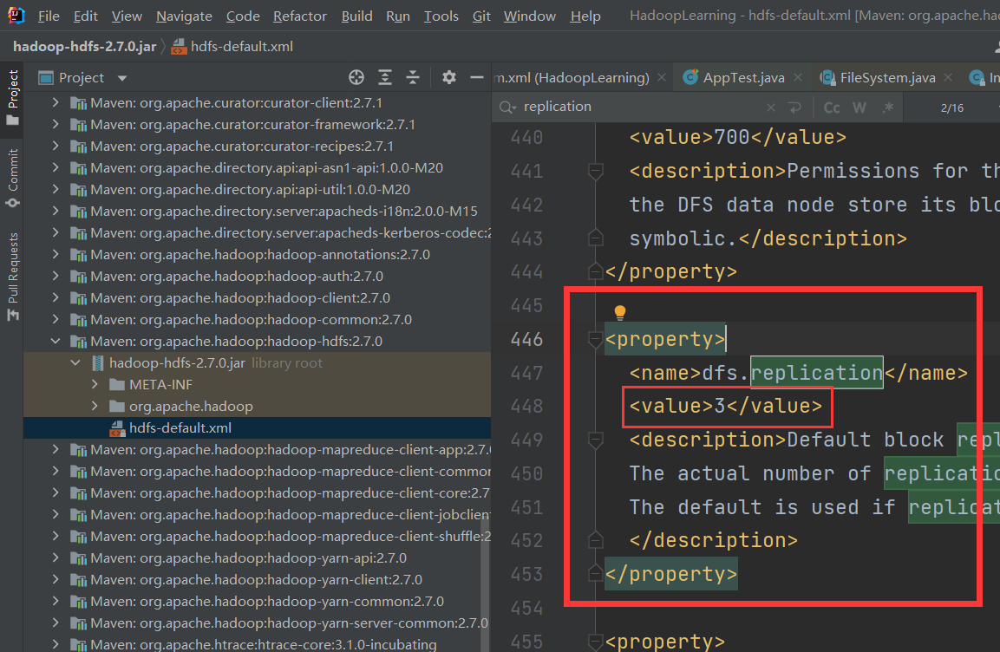

# Replication-Coefficient

HDFS 有两套配置

1. 在服务器端的 settings 里边有 xml 文件的一套配置
2. 在使用 Java 的 API 编程的时候，有一套配置信息，

在使用 Java 编程的配置信息，就是 Configuration 对象，当新建的 Configuration 实例化对象是默认情况的时候，就会自动加载 Java 的包中的配置文件的内容到 Configuration 的实例化对象中，可见下图

`import org.apache.hadoop.conf.Configuration;`

测试方法：
可是使用断掉调试的方式来查看 Configuration 的实例化对象有没有什么信息。

上述中的第二套配置信息的配置文件如下图所示：




# Configuration 对象

```java
Configuration configuration = new Configuration();
Configuration configuration.set("dfs.replication", "1");

// 示例： ==> 两者都是以字符串的形式传入
Configuration configuration.set("key", "value");
```

