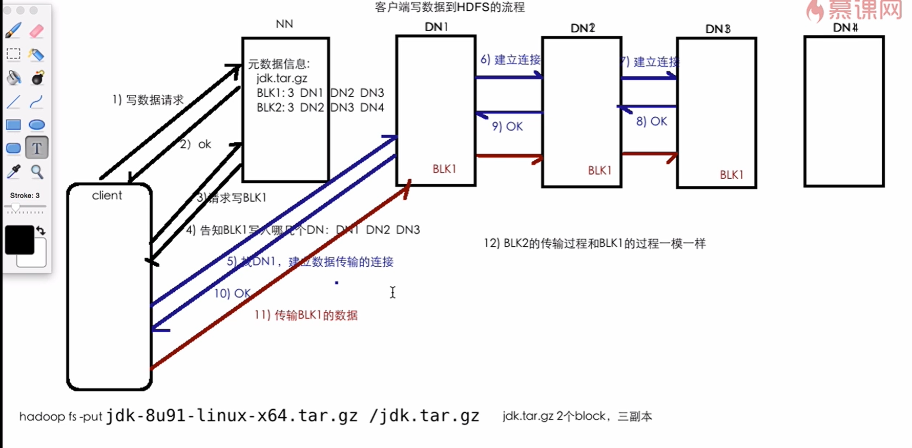

# Write Data Process

写数据（Block 1）的访问过程：

1. Client 发送写数据请求 ==> Name Node
2. Name Node  返回 okay ==> Client （可以写）
3. Client 请求写 Block 1 ==> Name Node
4. Name Node 通知 ==> Client 应把数据写入哪几个 Data Node ==> DN1 DN2 DN3
5. Client ==> 与 DN1 建议数据传输连接
6. Client ==> 与 DN2 建议数据传输连接
7. Client ==> 与 DN3 建议数据传输连接
8. DN3 返回连接建立成功 okay ==> Client
9. DN2 返回连接建立成功 okay ==> Client
10. DN1 返回连接建立成功 okay ==> Client
11. 传输 Block 1 ==> Data Node
12. 传输 Block 2 的过程从第 3 步开始 ==> 与 Block 1 的过程完全相同

写数据示意图：

