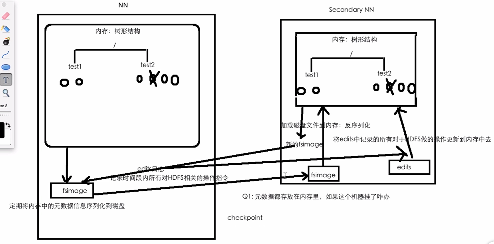

# Meta Information Management

## 内存中记录元数据产生的问题

在内存中记录目录树会产生的问题：

1. 元数据放在内存里，如果这个机器挂了怎么办？==>定期序列化到磁盘（fsimage 文件系统镜像）
2. 若半小时序列化一次到磁盘，这半小时的数据怎么办？ ==> 记录日志（edits）

若元数据都在磁盘中，则增删磁盘中的数据非常浪费时间，特别是删除一个文件的中间部分的数据或者在中间某个部分增加数据是更浪费时间的。那么记录日志的好处？记录日志只需要把操作的命令按照时间顺序在文件末尾堆叠数据，而并不需要增加或者删除中间部分的数据。

## Secondary Name Node

Secondary Name Node ==> 一个单独的进程
用来合并多个 edits 日志文件，其中 edits 日志文件是滚动的，若把所有的记录都一直向同一个文件中放，那么这个文件会变得越来越大，这样后期的访问速度会非常慢，滚动的方式记录，可以隔一段时间生成一个较小的日志文件，然后把小的合并在大的文件上去。
同时，当 HDFS 挂掉后， Secondary Name Node 加载旧的 fsimage 并反序列化到内存中，同时合并 edits 日志文件，通过两者生成一个一致性的 fsimage 最后替换掉 Name Node 中的 fsimage 文件

## Safemode

当安全模式（safemode） 是打开的时候，是不能够对 HDFS 进行操作的

当安全模式 （safemode） 关闭的时候才可以操作

心跳：每个三十秒 HDFS 集群会确认一下所有的机器是不是还或者，这个三十秒一次的信号称为心跳。

