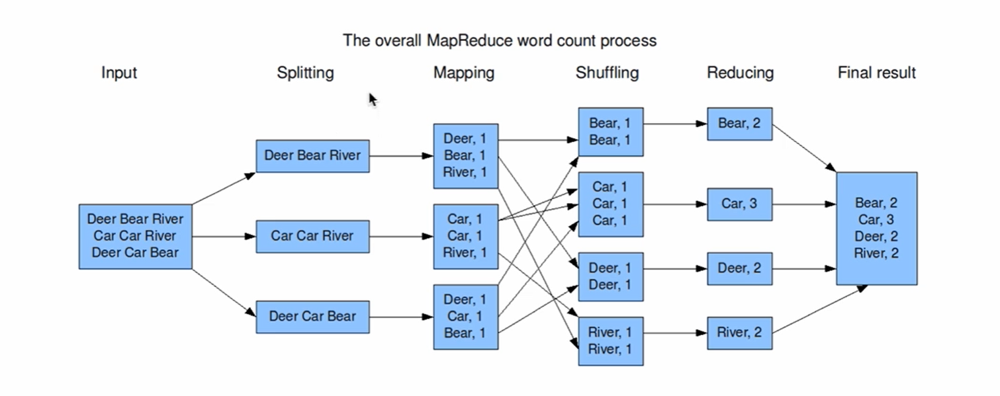

# MapReduce-Programming-Model

MapReduce 编程模型 ==> wordcount 词频统计流程图

- Splitting 
- Shuffling 

以上两个过程在编程模型中是不体现出来的

词频统计流程图解释：Input 下代表数据内容，Splitting 代表已经对输入数据完成分割后的结果，Mapping 代表已经完成映射后的结果，Shuffling 代表已经完成此操作后的结果，以此类推。

- Mapping And Reducing 分别是分布式计算 And 归并结果的过程，编程中只需要实现这两个部分

