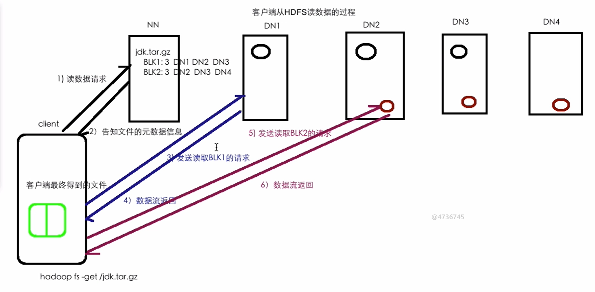

# Read-Data-Process

读取数据（Block 1 And Block 2）流程：

1. Client 发送读数据请求 ==> Name Node
2. Name Node 返回文件元数据信息 ==> Client 
3. Client 发送读取 Block 1 请求 ==> Data Node 1
4. Data Node 1 返回数据流 ==> Client
5. Client 发送读取 Block 2 请求 ==> Data Node 2
6. Data Node 2 返回数据流 ==> Client
7. Client 收到 Block 1 和 Block 2 和拼接在一起 ==> 完整文件

Node: 读取数据增加吞吐量的方法是：不同的 Block 分别从不同的主机上读取，但是相同的 Block 的数据流通道只会有一个

读取数据示意图：

