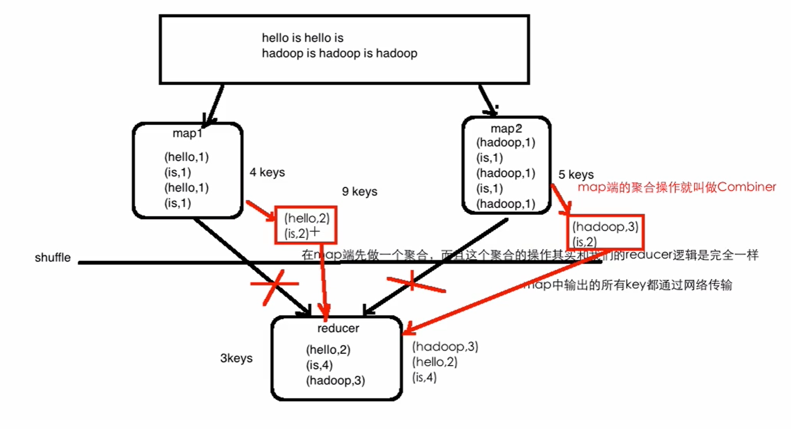

# Word-Count-Combiner

- Combiner 操作的实质上就是 map 端提前进行一次 reducer 的操作，这样在网络传输的时候，可以减少传输的数据量。
- map 端的 聚合操作（reducer）称为 Combiner 
- 先由 map 端进行一次预聚合操作（reducer）再 shuffle 到 reducer 上
- shuffle 操作就是把键相同的数据分别回收到一起

Combiner 图解：

Combiner 的优缺点：

- 优点：Combiner 的优点：能减少 IO，提升作业的执行性能
- 缺点：如求平均数 ==> 除法操作在 Combiner 中要慎重