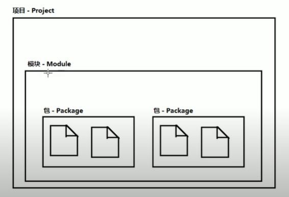
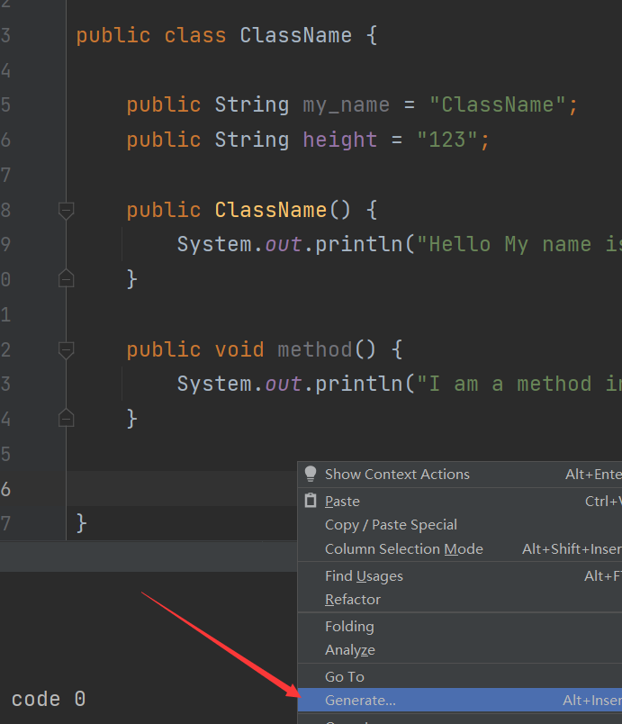
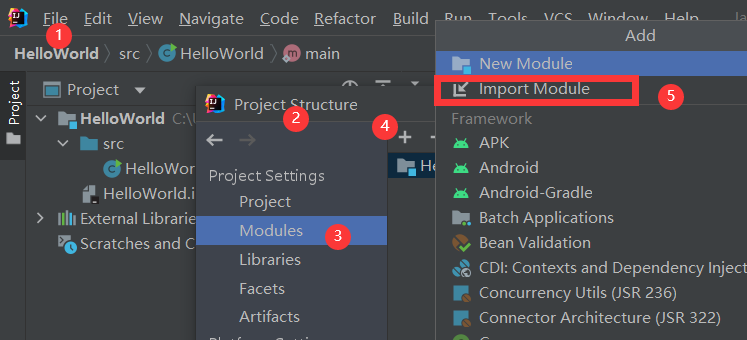
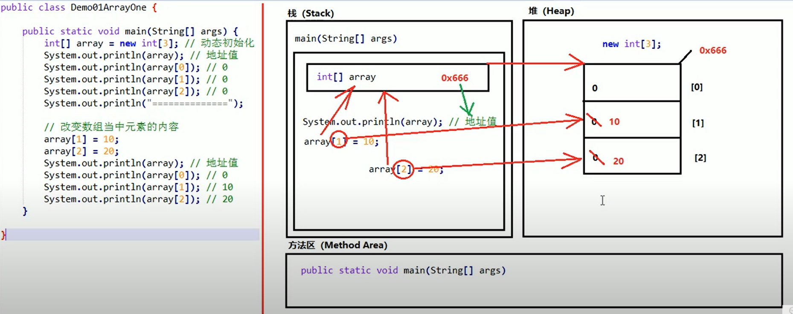
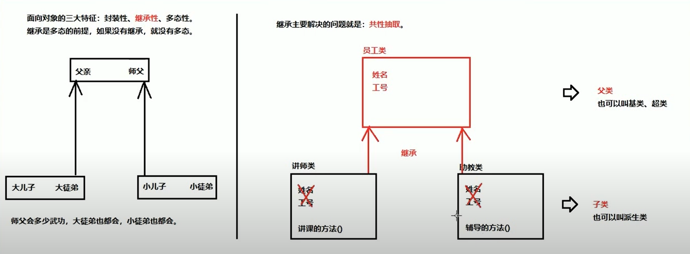
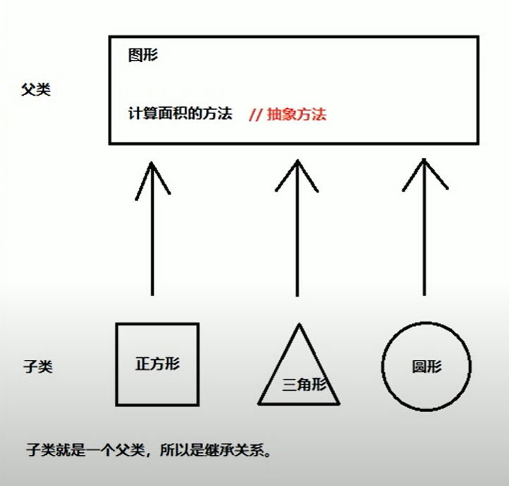
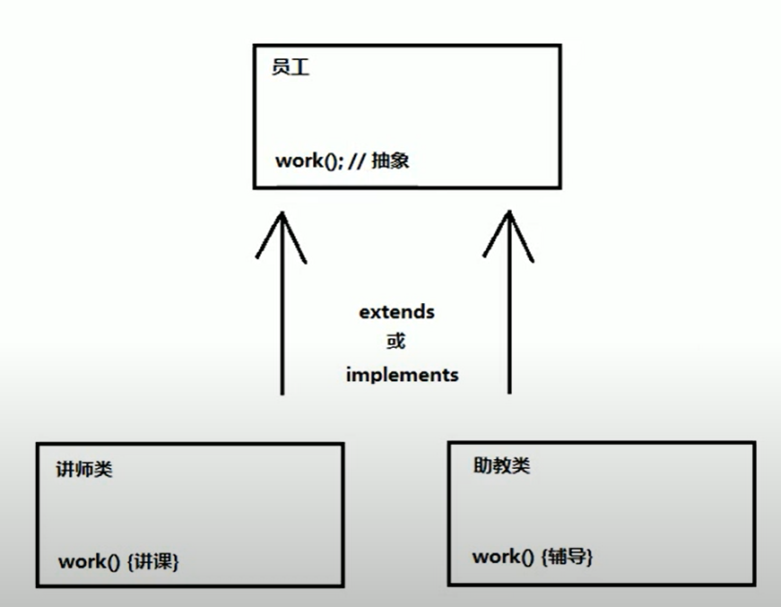

参考课程:
https://www.youtube.com/watch?v=P7izmVK-dCE&list=PLmuZ8T57c_h0rRCzwT5hYQNRUYkAF1y9y&index=12

# 001 - Javac 和 Java 两个程序

java 文件： java 文件的类名必须与文件名保持一致
javac ==> 编译 java 程序 （Java Compiler）
java ==> 运行 java 字节码 （file_name.class 文件）

    javac file_name.java
    java file_name (运行的是 class 文件，字节码)

==   对于引用型变量比较的是所指向的对象是否是同一个


# 002 - Java 项目结构



Java-Package（Java 的包）是一组文件夹组成的
com.lijh.hdfs ==> 三个文件夹 ==> com ==> lijh ==> hdfs


# 003 - IDEA 快捷键
生成 main 方法: psva (public static void main)
生成 println 输出语句: sout (system.out.println)
修复错误代码快捷键：Alt + Enter 会给出修复建议
删除光标所在行：Ctrl + y
复制光标所在行：Ctrl + d
格式化代码: Ctrl + Alt + l
上下移动代码：Alt + Shift + 上/下



# 004 - IDEA导入新的 Module
Moudle 文件夹拷贝当项目目录下后，通过下图的方式导入
File ==> Settings ==> Project Structure ==> Modules ==> "+"加号 ==> Import Module



# 005 - 成员函数重载

同名不同参数 ==> 重载

# 006 - 数组

1 动态初始化数组
dataType[] arrayName = new dataType[arrayLength]

2 静态初始化
dataType[] arrayName = new dataType[] {value, ...}

3 静态初始化...省略格式
dataType[] arrayName =  {value, ...}

#  007 - Java 内存划分

Java 的内存划分为五个部分:

1 栈 Stack : 存放的是方法中的局部变量
        局部变量：方法的参数，或者是方法内部的变量
2 堆 Heap：凡是 new 出来的东西，都在堆当中
        堆内存里面的东西都有一个地址值：16 进制的
        堆内存里边的数据都有默认值，规则：
        整型 默认为 0
        浮点数 默认为 0.0
        字符 默认为 '\u0000'
        布尔 默认为 false
        引用类型 默认为 null
3 方法区 Method Area：存储 .class 的相关信息，包含方法的信息，但是正在运行的方法都存放在栈中，方法区仅仅是死数据
4 本地方法栈 Native Method Stack : 与操作系统相关
5 寄存器 Register : 与 CPU 相关
一段代码的内存描述图：


# 008 - 接口 Interface

接口是多个类的公共规范，
接口是一种引用数据类型，最重要的内容就是其中的抽象方法
接口被编译后生成的文件仍然是 .class 类型的文件
如果实现类并没有覆盖重写接口中的所有抽象方法，那么这个实现类自己必须就是抽象类

## 接口使用规则

1. 接口不能直接使用，必须有一个实现类来实现接口
2. 接口中所有的抽象方法必须全部覆盖重写，类若继承多个接口，则重名的抽象方法覆盖重写一次即可
3. 接口中不能定义构造函数，不能定义静态代码块
4. 如果一个类实现的多个接口中，有重复的抽象方法，那么只需要覆盖重写一次即可
5. 若继承多个接口出现默认方法名重复，则必须覆盖产生冲突的默认方法

Java 7 可包含：

- 成员变量：常量
- 抽象方法

Java 8 可额外包含

- 默认方法
- 静态方法

Java 9 可额外包含

- 私有静态方法

接口中方法的定义：

1. 定义常量
2. 定义抽象方法
3. 定义默认方法：为了解决接口升级的问题，因为之前的版本要求覆盖所有的抽象方法，但是当接口改动之后新添加了一个方法，可是实现类并没有实现这些新添加的抽象方法那么就会出现问题
4. 定义静态方法
5. 定义私有方法：

   		1）普通私有方法，解决多个默认方法之间代码重复问题
   		2）静态私有方法，解决多个静态方法之间重复代码问题

```Java
public interface interfaceName {
    // 1 定义成员变量:常量
    //   从效果上看就是常量
    public static final 数据类型 常量名称 = 数据值;
    public static final dataType VAR_NAME = value;
    // public ==> 都可使用
    // static ==> 静态的，直接接口名点属性, 对于类的静态方法也是同理的
    // final ==> 不可改变
    // 即使不写这些关键字，也默认是这个属性
    // 接口中的常量必须赋值
    
    // 2 定义抽象方法 - 四种方式等效
	public abstract void methodOne();
    abstract void methodTwo();
    public void methodThree();
    void methodFour();
 	
    // 3 定义默认方法
    public default void method() {
        // ...
        // 若
    }
    
    // 4 定义静态方法
    public static void methodStatic() {
        // ...
        // 不能通过接口实现类来调用接口的静态方法
        // 应该通过接口名直接调用静态方法
        // 静态方法的调用不需要创建一个实例对象
        
        // 适用于不想让实现类访问的情况
        // 用于抽取公共方法
        
        // 如，可以让默认方法使用
        // 但是不能让实现类使用
    }
    
    // 5-1 普通私有方法
    private void method() {
        // ...
    }
    
    // 5-2 静态私有方法
    private static void method() {
        // ...
    }
}
```

## 接口之间的多继承

1. 一个类只能继承一个类
2. 一个类可以实现多个接口
3. 一个接口可以继承多个接口

```java
public interface MyInterfaceA {
    public abstract void methodA();
    public abstract void methodCommon();
}

public interface MyInterfaceB {
    public abstract void methodB();
    public abstract void methodCommon();
}

// 子接口
// 子接口中有 4 个方法
// 继承的两个接口，重名的情况按一个接口算
// 抽象方法并不会产生冲突 ==> 重复没关系
// 但是默认方法重复则会冲突 ==> 有关系
// 此时子接口必须覆盖重写冲突的默认方法
// 而且必须带有 default 来修饰此默认方法
public interface MyInterface extends MyInterfaceA, MyInterfaceB {
    public abstract void method();
}

public interface MyInterface extends MyInterfaceA, MyInterfaceB {
    public abstract void method();
}
```


# 009 - 类和面向对象

面向对象的三大特征：
        1 封装性：父类 ==> 基类、超类（高层）；子类 ==> 派生类
        2 继承性：主要解决 **共性抽取，代码复用** (所有类的祖宗都是java.lang.Object)
        3 多态性：用父类的引用来使用子类

## 封装性



## 继承性

仅支持单继承

```java
public class 类名 extends 父类名 {
    // ...
    // extends class_name ==> 扩展自 class_name 
}
```

成员变量的规则：成员变量重名，优先访问子类的成员变量，若没有则向上查询。

```java
// 三者重名
// 局部成员变量、类成员变量、父类(super)成员变量
// 1 访问局部变量 ==> 直接使用变量名
int nums;
nums = 666;

// 2 访问类成员变量
public class class_name {
    int hello;
    public static int getHello() {
        return this.hello
    }
}

// 2 访问父类成员变量
// super ==> 表示超级 ==> 也就是超类 即 父类
public class sub_class_name extends class_name {
    int hello;
    public static int getParentHello() {
        return super.hello
    }
}

```

成员函数重名时的访问规则：实例化对象优先访问当前类，若没有则向上查找。在编写子类的时候使用 super 点的方式调用父类的成员函数。

方法的重写（覆盖）Override
1 要求成员函数名相同、参数列表相同
2 子类重写的方法的返回值必须小于等于父类的返回值（这里的小是指子类方法的返回值的类型必须是父类方法返回值类型的子类或者与父类返回值类型相同）
3 权限大小关系:public > protected > (default) < private
default 不是关键字而是留空，子类方法的权限必须大于等于父类方法的权限
疑问：default 是个什么鬼权限？

```java
public class Parent {
    public void method() {
        
    }
}


// 为了保证检测是否重写成功
// 使用注解 @Override 来检查，可选项
// 疑问：
// 预编辑阶段注解起作用，就像 C 语言的预处理？
public class Son {
    
    @Override
    public void method() {
        
    }
}

```

构造函数 ==> super 就相当于父类的实例对象

1. 子类构造函数中有默认的 super() 的调用，super() 相当于调用父类的实例对象的构造函数
2.  java: 对super的调用必须是构造器中的第一个语句
3. 当父类中没有默认的无参数构造函数的时候，必须手动写出调用父类构造函数的语句
4. 若显示的写出 super() 构造器的调用，则编译器只会默认添加一个无参数构造的 super() 调用
5. super() 和 this() 只能选择一个

```java
public class Parent {
    public Parent() {
        // ...
    }
}

public class Son extends Parent {
    public Son() {
        super(); // 可选，默认会带这个语句
        // ...
    }
}

Son son = new Son();
// 此时会先执行父类的构造函数
// 然后才会执行子类构造函数
// 因为子类用到父类的资源
// 所以父类需要先初始化才可以
```

## super 关键字

super 关键字的三种用法

1. 在子类中访问父类实例对象的成员变量
2. 在子类中访问父类实例对象的成员函数
3. 在子类的构造函数中访问父类的构造函数

```java
public class Parent {
    public Parent() {
        // ...
    }
    
    // ...
}

public class Son extends Parent {
    public Son() {
        // 3 
        super(); // 可选，默认会带这个语句
        // 1 
        super.var_name;
        
        // 2 
        super.method();
    }
}

Son son = new Son();
```

## this 关键字

this 关键字的三种用法

1. 访问本类的成员变量
2. 访问本类的构造函数
3. 访问本类的成员函数

```java
public class class_name {
    public Son() {
        // 在无参构造函数中
        // 调用本类的有参构造函数
        // 同样必须 this(666) 是第一条语句
        // 且只能使用一次调用
		this(666);
    }
    
    public Son(int nums) {
        
    }
}

Son son = new Son();
```


抽象
抽象的概念：
图形的面积 ==> 各种各样的图形独有其面积计算方法
类中的方法不确定如何实现，那么此方法应是一种抽象方法，具体实现要放在子类中



一段代码实例：

```java
// 抽象方法所在的类必须是抽象类
// 抽象类不能够实例化
// 定义抽象类
public abstract class Animal {
    // 若出现抽象方法，则必须是抽象类
    public abstract void eat();
    
    // 普通方法的定义不受影响
    // 普通方法可以出现在抽象类中
    public void method() {
        // ...
    }
}

// 必须使用一个子类来继承抽象类来使用它
// 子类必须实现父类的所有抽象方法
public class Cat extends Animal {
    @Override
    public void eat() {
        // ...
    }
}

// 使用
Cat cat = new Cat();
cat.eat();
```

## 抽象类

### 注意事项

抽象类的四点注意事项：

1. 抽象类不能创建抽象对象，如果创建，编译无法通过而报错，只能创建其非抽象子类的对象。
2. 抽象类中可以有构造函数，是提供子类创建对象时，初始化父类成员使用的。
3. 抽象类中，不一定包含抽象方法，但是有抽象方法的类必定是抽象类
4. 抽象类的子类，必须重写父类中所有的抽象方法，否则编译无法通过，除非该子类也是抽象类则不必重写所有父类抽象方法
5. 一个类的父类中的方法和所实现的接口中的方法产生了冲突，那么会优先使用父类中的方法

### 静态代码块

静态代码块 static block

```java
// 静态代码块位于类的内部 接口中不能够定义静态代码块
// 静态代码块的执行优先于类的构造函数
// 静态代码块可以存在多个，并且执行顺序是按照在类中
// 定义的先后顺序由上至下依次执行的
public class Parent {
    
    public Parent() {
        System.out.println("I am parent class constructor");
    }

    static {
        System.out.println("I am static code block - two");
    }

    static {
        System.out.println("I am static code block");
    }

    static {
        System.out.println("I am static code block - three");
    }

}

// 执行如下语句后
Parent parent = new parent();

// 输出示例：
// I am static code block - two
// I am static code block
// I am static code block - three
// I am parent class constructor
```


## 多态性

一个对象拥有多种形态，这是对象的多态性

小明 ==> 学生 ==> 人类
则：小明既有学生的形态又拥有人类的形态，指的是对象的多态性（实例化对象的多态性）而不是本身那个类

多态性的前提：

1. extends 继承
2. implements 实现 是多态性的前提

代码中体现多态性：

1. 父类名称 对象名 = new 子类名称();
2. 接口名称 对象名 = new 实现类名称();

总结：父类引用指向子类引用，以父类的形态来使用子类

成员变量的访问规则 和 成员函数的访问规则，用多态的写法时，都不会产生任何变化 （成员变量不能覆盖重写，只会向上查找，并不会向下查找，调用方法的时候，优先从下向上查找，即使是使用父类的引用，那么也是从子类的方法开始向上查找）

若子类特有的方法，但是父类没有的话，这时候编译错误，当使用父类引用调用方法的时候，存在父类和子类的方法相同的时候优先调用子类的方法，若此时仅有子类拥有该方法但是使用了父类的引用则错误

使用多态的好处：



```java
// 1 如果不用多态
Teacher one = new Teacher();
one.work(); // 讲课
Assistant two = new Assistant();
one.work(); // 辅导

// 2 使用多态，则不必关心谁在工作
// 对于写框架是有好处的，不用改代码了
// 更加灵活
for employee in all_employee:
	// 让员工工作即可，不关心谁工作
	employee.work(); 
```

### 向上转型
创建一个子类对象，当作父类对象看待和使用 （向上转型安全）
从小范围转向了大范围
弊端，子类特有的方法是不能够使用的
格式 ==> 父类名 对象名 = new 子类名();
什么时候用向上转型？当这件事情可以被各式各样的派生类完成的时候使用向上转型

### 向下转型
类似于强制类型转换，最多仅能转换为 new 出来的子类对象
格式 ==> 子类名 对象名 = (子类名)父类对象; 
什么时候向下转型呢？就是当只有具体的某个子类对象才能完成的事情，这时候才需要向下转型
通过 instanceof 关键字来判断类型，从而安全向下转型


### instanceof 关键字

如何知道父类的引用的对象原本是一个什么类型的子类？
向下转型可出发的异常： 类转换异常

```java
// 假设现在又两个类
// 父类是 ： animal
// 子类是 ： Cat
// 子类是 ： Dog

// 多态写法 
Animal animal = new Cat();

// 若 animal 本来是 Dog 子类 则该语句返回 True
if(animal instanceof Dog) {
    Dog dog = (Dog) animal;
    dog.watchHouse();
}

// 若 animal 本来是 Cat 子类 则该语句返回 True
if(animal instanceof Cat) {
    Dog cat = (Cat) animal;
    cat.catchMouse();
}

```

## 关键字

### static

```java
public class class_name {
	public static void method();
}

// 静态成员函数可以直接调用
// 而不必实例化对象
// 所谓静态，就是一直静止的
// 类的内部改变和它没有什么关系
// 所以不用实例化就可以直接调用了
class_name.method();
```


### final

final ==> 不可改变的

final 的四种用法：

1. 可以用来修饰一个类：当前的类不能有任何子类
2. 可以用来修饰一个方法： 当前的方法不能够被子类覆盖重写
3. 可以用来修饰一个局部变量
4. 可以用来修饰一个成员变量

```java
// 1 可以用来修饰一个类
// 当前的类不能有任何子类
// 除了不能被继承外，没有任何其他影响
// 则所有的方法都不能被覆盖重写
public final class MyClass {
    // ...
}

// 2 可以用来修饰一个方法
// 则当前的方法不能够被子类覆盖重写
public class MyClass {
    // ...
    public final void method() {
        // ...
    }
}

// 3 可以用来修饰一个局部变量
// 一次赋值，再也不可改变
// 对于基本类型：变量当中的数值不可变
// 对于引用类型：不可改变引用指向的对象
//              但所指对象的内容可变
// 
public final class MyClass {
    // ...
    public static void main(String[] args) {
        final var = 666;
    }
}

// 4 可以用来修饰一个成员变量
// 对于成员变量来说，不可改变
// 1）直接赋值
// 2) 通过构造函数赋值, 构造函数中普通形式赋值是允许的
//    所有的构造函数必须都对它赋值才行

// 1)
public class MyClass {
    // ...
    public final version = 666;
    public MyClass() {
    	// ...
    }
}

// 2)
public class MyClass {
    // ...
    public final version;
    public MyClass() {
        // 这种写法是允许的
        this.version = 666;
    }
}


```


# 010 - 反射

反射是框架设计的灵魂
什么是反射：将类的各个组成部分封装为其他对象，这就是反射机制（就像 Python 中的类本身就是个对象，一切皆对象，在运行的过程中，类本身还可以变化，类不再是死的模板）

## Java 运行的三个阶段

1. file.java ==> file.class （源码阶段，javac 编译）
2. ClassLoader（类加载器，Class 类对象阶段 | 加载阶段）在内存中有一个类 Class 类用来描述字节码文件 file.class 相当于我们写的类的元信息，所以，只要我们能够修改它的元信息就可以在运行过程中动态地修改我们一开始写好的类了
3. 运行时阶段 （Runtime）

反射的好处：

1. 可以在运行过程中操纵一开始写好的类，例如 IDEA 的代码提示就算是一种反射思想的应用
2. 可以解耦，提高程序的可扩展性

## Classs 对象的获取

```java
// 1 将字节码对象加载进内存获取类对象 
// 返回 Class 对象 
// 全类名 = 包名.类名
// 多用于配置文件 
Class.forName("全类名") // forName 静态方法
    
// 2 已经加载进内存了，但是还没有实例化对象
// 多用于参数的传递
类名.class
    
// 3 已经有实例化对象了
// 多用于对象的获取字节码的方式
实例化对象.getClass()
    
// getClass 方法定义在 Objet 对象中
// 以上三种方法获取的都是同一个 Class 对象
// 一个字节码文件，在程序的一次运行中，只会被加载一次

import java.lang.Class;
Class cls = object.getClass();
```


## 使用 Class 对象

1. 获取成员变量们
2. 获取构造方法们
3. 获取成员函数们
4. 获取类名


```java
// 1 获取成员变量们
// 获取所有 public 修饰的成员变量
Field[] getFields();
Field getField(String name);

// Declared 方法可以获取所有内容，不考虑修饰符
// 私有的方法都能获取
Field[] getDeclaredFields();
// 可以获取任意一个单个变量
Field getDeclaredField(); 
```


```java
// 2 获取构造方法们
Constructor<?>[] getConstructors();
Constructor<T> getConstructor(类<T>...ParameterTypes);
Constructor<?>[] getDeclaredConstructors();
Constructor<T> getDeclaredConstructor(类<T>...ParameterTyps);
```


```java
// 3 获取成员方法们
Method[] getMethods()
Method GetMethod(String name, 类<?>...parameterTypes)

Method[] getDeclaredMethods()
Method GetDeclaredMethod(String name, 类<?>...parameterTypes)
```


```java
// 4 获取类名
String getName();
```


## Field 对象

在使用 Field 的方法的时候，应该抛出相应的异常，否则编译不通过

### get 方法

```java
// 设有 Field 对象 field 属于 object 的字段
// 设有实例对象 object

// object 是指具体的要操纵的实例对象
// field 仅仅是一套模板，最终需要与具体的实例对象绑定
Object var_name = field.get(Object object)
```

### set 方法

```java
// object 是指具体的要操纵的实例对象
// value 是指具体要赋的值
Object var_name = field.get(Object object, Object value)
```

### setAccessible 方法

```java
// 忽略安全访问权限
// 暴力反射 ==> 不做安全检查
field.setAccessible(true);
```


下一期视频：460 小集 ~ 反射获取 constructor 


# 011 - 注解

## 学习目标

1. JDK 中预定义的注解的使用方法
2. 学习如何自定义注解

## 概念 注解 Annotation

1. 注释：给人看的
2. 注解：给计算机看的，用来说明程序的
3. 使用注解：@ 符号 + 注解名称 = @AnnotationName

## 作用分类

1. 编译检查 ==> @Override
2. 生成文档 ==> javadoc 命令 ==> 都是用已经定义好的文档
3. 代码分析 ==> 通过代码里标识的注解对代码进行分析，使用反射

```java
// 2 生成文档示例

/**
* 注解 javadoc 演示
* @author lijh
* @version 1.0
* @since 1.5
*/

public class AnnoDemo {
	/**
	* 计算两数的和
	* @param a 整数
	* @param b 整数
	* @return 两数的和
	*/
	
	public int add(int a, int b) {
		return a+b;
	}
}

// 使
用命令 javadoc 生成文档，抽取注解
// 生成一堆文件，打开 index.html 文件
```

## JDK 内置注解

1. @Override : 检测被该注解标注的方法是否覆盖了父类方法或者接口方法
2. @Deprecated ：将该注解标注的内容，标注为过时，坚持要使用也是可以的，建议不要使用，不仅可以兼容低版本，还可以提醒使用者使用更新的方法
3. @SuppressWarnings：有很多警告信息，不想让它提示，那么就用这个注解可以达到压制警告的效果，一般传递参数 all


```java
// 3 这样的意思代表压制所有警告
@SuppressWarnings("all")
// 可以写带类的上边一行，也可以写在方法的上边一行
// 写在更大范围的对象上边一行则压制警告的范围也就更大
```

## 自定义注解


1. 格式  ==> 自定义注解格式

2. 注解的本质 ==> 注解的本质是接口

3. 属性：接口中的抽象方法 = 属性
   		
     1) 属性(数值是指成员函数)的返回值类型：基本数据类型，字符串，枚举，注解，以上类型的数组
     
     2) 在使用此注解的使用，应该为其属性（成员函数）赋值才可以。可使用 default 关键字为其赋一个默认值，这样就不必在使用的时候强制再次赋值了。如果只有一个属性需要赋值，那么可以省略属性的名称直接在使用注解的时候只写该属性的值即可。

```
// ps: 反汇编命令
javap ==> javap fileName.class
```

```
// 1 自定义注解 举个例子
public @interface 注解名 {
	// ...
	int int_methodName();
	String string_methodName();
	
	// 可以通过这种方式来赋一个默认值
	// 那么在使用此注解的时候就不必一定要为它赋值了
	int my_name_method() default "lijh";
	
	// 枚举类型 ==> 赋值
	enumType enum_method();
	// 注解类型的方法 ==> 赋值
	annoType anno_method();
	// 如果数字中只有一个值，那么在赋值的时候，花括号可以省略 ==> 赋值
	type[] array_method();
}

// 注解的使用
// 因为 赋值的过程非常像属性所以 称 方法 为 属性
// 赋给方法的值的类型应与此方法的返回值类型保持一致
@注解名(int_methodName = int_value, string_methodName = string_value, enum_method = enumType.attr, anno_method = @annoType, array_method = {value_1, value_2, value_3})
public class Worker {

}
```


## 元注解

元注解：用于描述注解的注解

### 举个例子

```java
@Target(ElementType.METHOD)
@Retention(RetentionPolicy.SOURCE)
public @interface Override {
	// ...
}

// 解析 Target
// @Target(ElementType.METHOD)
// Target 来指明 Override 注解应在用在什么地方
// ElementType.METHOD 表明此注解应该用在类方法上边

// 解析 Retention
// 指明此注解被保留的时间持续到什么时候
// RetentionPolicy.SOURCE 表明在源码阶段
// Java 运行程序的三个阶段
// 源码阶段 ==> 加载阶段 ==> 运行阶段
```

### 需要掌握的元注解

1. @Target : 描述注解能够作用的位置
2. @Retention : 描述注解被保留的阶段
3. @Documented : 描述注解是否被抽取到 API 文档中，使用 javadoc 进行文档生成的时候，是否告诉读者那些使用此定义注解标注过的对象是使用过此自定义注解标注的，也就是说自定义注解是可以被抽取到 javadoc 文档中的
4. @Inherited：描述此注解是否被子类继承，若使用此注解描述自定义注解，那么子类会自动继承父类使用的注解

```java
// 1 @Target
// ElementType ==> 枚举类型
@Target(ElementType.Type) // 只能作用于类上
@Target(ElementType.METHOD) // 只能作用于方法上
@Target(ElementType.FIELD) // 只能作用于成员变量上
@Target(value={ElementType.Type, ElementType.METHOD, ElementType.FIELD}) // 三者都能作用

// 2 @Retention
// RetentionPolicy ==> 枚举类型
@Retention(RetentionPolicy.SOURCE)
@Retention(RetentionPolicy.CLASS)
// 运行时可通过被描述的自定义注解所标注的对象读取到该注解
@Retention(RetentionPolicy.RUNTIME) 

// 3 @Documented
// 使用该元注解修饰过的自定义注解
// 则 自定义注解所标识过的  对象
// 在生成文档的时候，会告诉读者
// 此  对象 是使用此自定义注解标注过的

// 4 @Inherited
// 若自定义注解使用 @Inherited 描述
// 那么，使用此自定义注解的对象若被继承
// 则子对象也会自动默认使用了该自定义注解标注
```


## 解析注解 注解的作用

1. 在程序使用（解析）注解：获取注解中定义的属性值，大多数可以用来简化配置文件，比如 Web 框架的 URL 描述
2. 若该注解放在一个方法上的，那么这个方法也是又 getAnnotation 方法的，同样可以获取到此方法的注解对象，成员变量（字段 Field）也是同理的

```
// 定义注解 
@Target(ElementType.TYPE)
@Retention(RetentionPolicy.RUNTIME)
public @interface Pro {
    String className();
    String methodName();
}

// (1)定义注解 ==> (2)自动生成一个类(该类包含那些属性，以及见解访问属性的抽象方法) 
// ==> (3)使用一次注解就实例化一个该类的实例化对象

// 使用一次注解 ==> 就相当于生成了一个该接口的实现类的实例化对象
@Pro(className = "hello", methodName = "666")
public class ReflectTest {
	public static void main(String[] args) throws Exception {
		// 1 获取被注解的类的字节码对象 即该类的 Class 对象
		Class<ReflectTest> reflect_test_class = ReflectTest.class;
		
		// 2 获取注解对象 ==> 获取实例化对象
		// Pro[] pro reflect_test_class.getAnnotations();
		// 一个类可以被很多注解描述，指明获取 Pro.class 类型的注解
		// Pro pro 定义了引用，指向了它的实现类对象，这其实就是多态啊！
		Pro pro = reflect_test_class.getAnnotation(Pro.class);
		
		// 3 调用注解对象中定义的抽象方法，获取返回值
		// 到这里也就明白了，注解中的抽象方法会被自动实现称为属性值的返回方法
		// 即会被自动实现称为间接获取属性值的方法，达到属性与方法属性统一的代码
		// 其实就是在内存中自动生成了一个 该注解类型的 子类接口的实现对象
		// 注解的本质是接口
		String ss = pro.className();
		
		// result:知道某个类的 全类名=包名.类名 后就可以通过反射机制来使用此类了
	}
}
```

