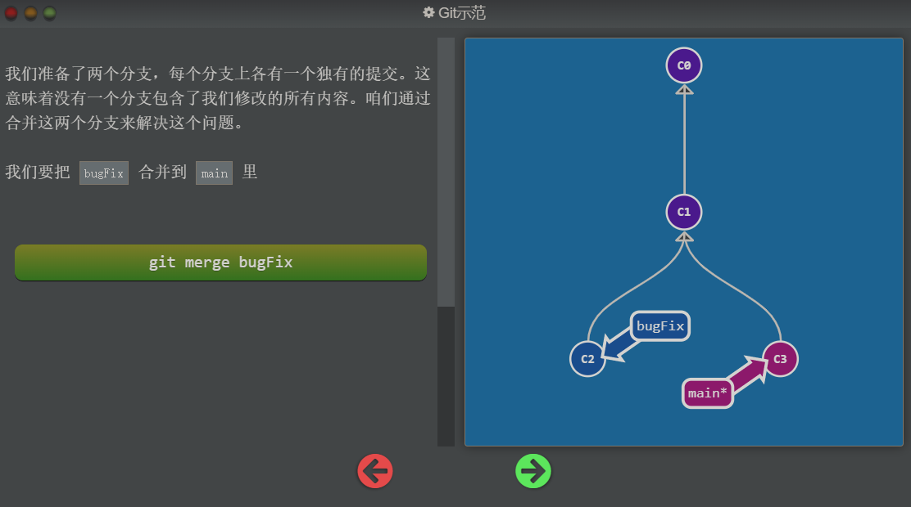
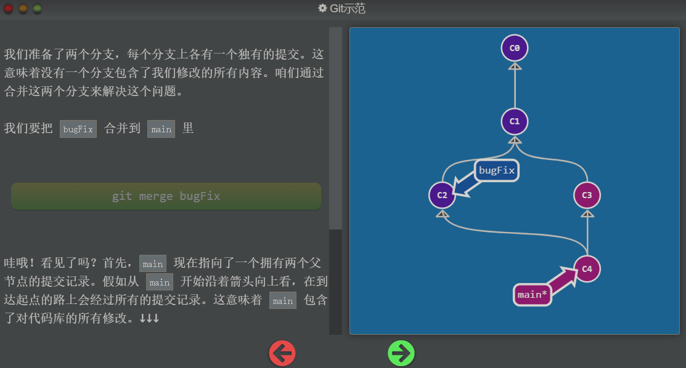
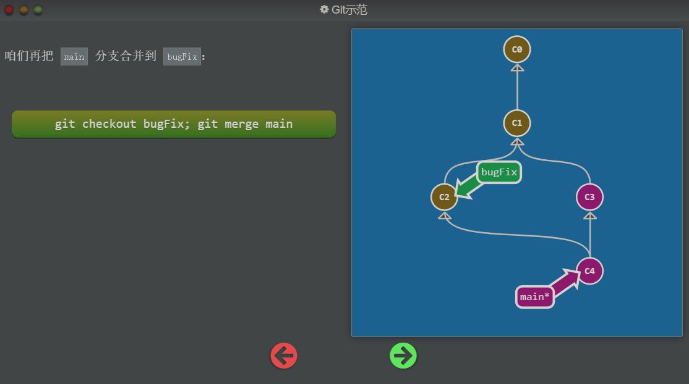
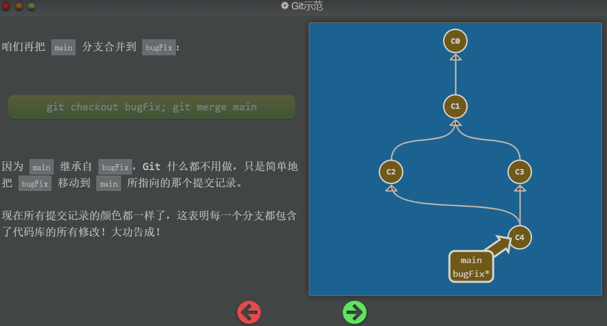
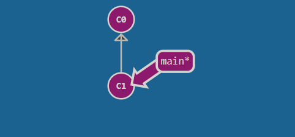
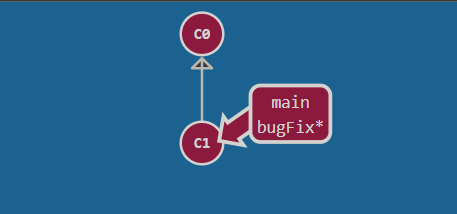
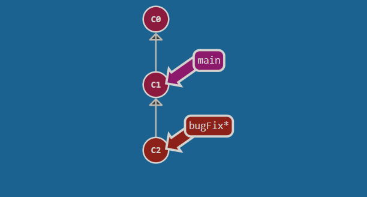
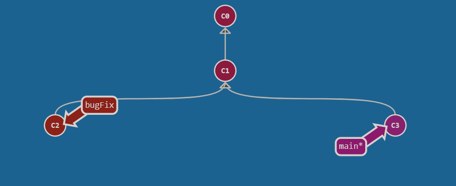
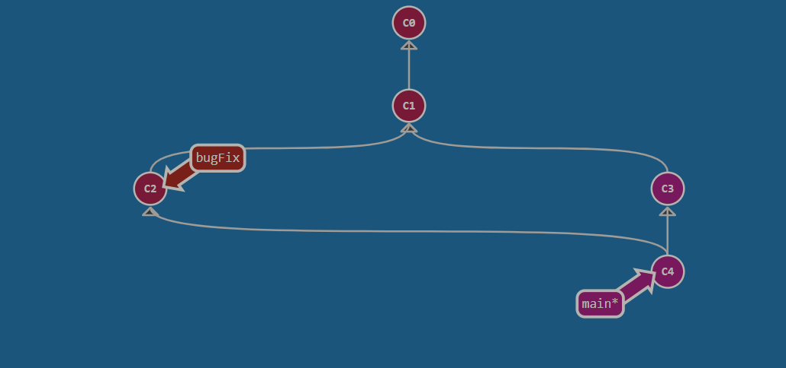

## Git Merge 分支与合并

太好了! 我们已经知道如何提交以及如何使用分支了。接下来咱们看看如何将两个分支合并到一起。就是说我们新建一个分支，在其上开发某个新功能，开发完成后再合并回主线。

咱们先来看一下第一种方法 —— `git merge`。在 Git 中合并两个分支时会产生一个特殊的提交记录，它有两个父节点。翻译成自然语言相当于：“我要把这两个父节点本身及它们所有的祖先都包含进来。”

通过图示更容易理解一些，咱们到下一页看一下。

## 图解过程 - 合并到 main 分支

将 bugFix 分支和 main 分支合并在一起，`git merge branch_name` 命令会把 `branch_name` 分支合并到 HEAD 所指向的分支上边，最终 HEAD 依然指向合并前它所指向的分支

## 图解过程 - 合并到 bugFix 分支

需要先执行 `git checkout bugFix` 切换到 bugFix 分支，然后再把 main 分支合并到 bugFix 分支，在游戏中使用颜色的异同标识修改

## 任务

要想通过这一关，需要以下几步：

- 创建新分支 `bugFix`
- 用 `git checkout bugFix` 命令切换到该分支
- 提交一次
- 用 `git checkout main` 切换回 `main`
- 再提交一次
- 用 `git merge` 把 `bugFix` 合并到 `main`
- 你随时都可以用“objective”命令来打开这个对话框！

## 任务实现过程

1. 初始状态

2. 创建 bugFix 分支
   `git branch bugFix; git switch bugFix` 或 `git checkout -b bugFix`

3. 在 bugFix 分支提交一次记录 `git commit`

4. 切换回 main 分支，并在 main 分支提交一次记录
   `git switch main; git commit`

5. 把 bugFix 分支合并到 main 分支

   `git merge bugFix` 把，bugFix 分支合并到 HEAD 所指向的分支上去

## 总结

合并 branch_name 分支到 HEAD 所指向的分支：`git merge branch_name`

