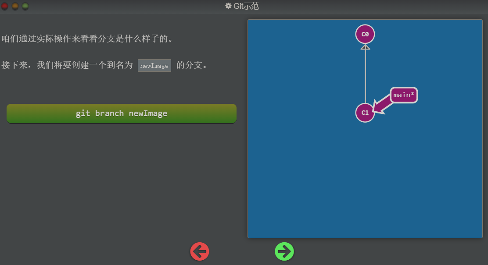
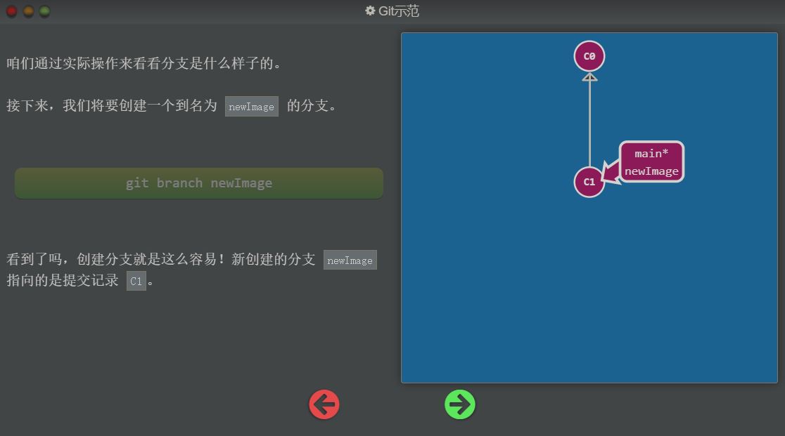
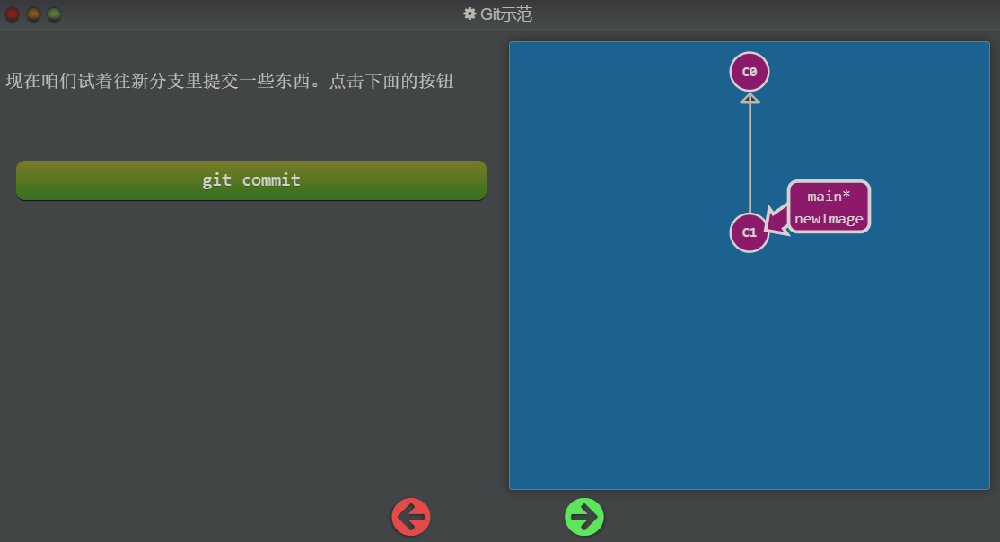
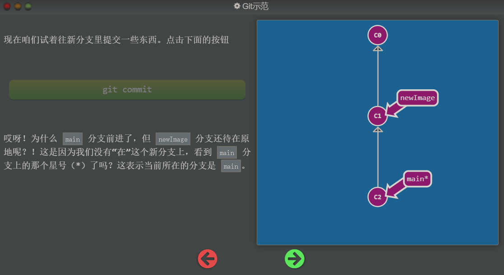
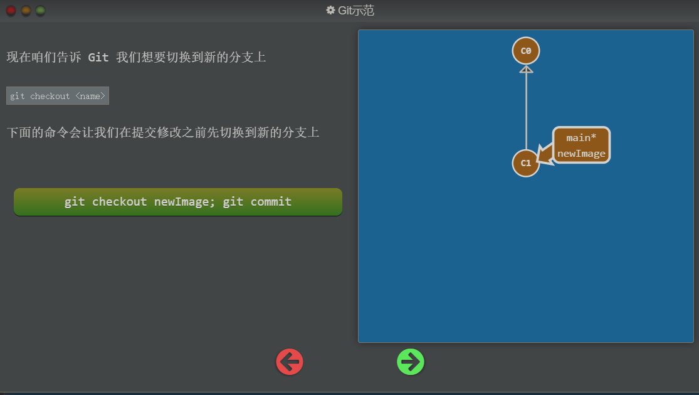
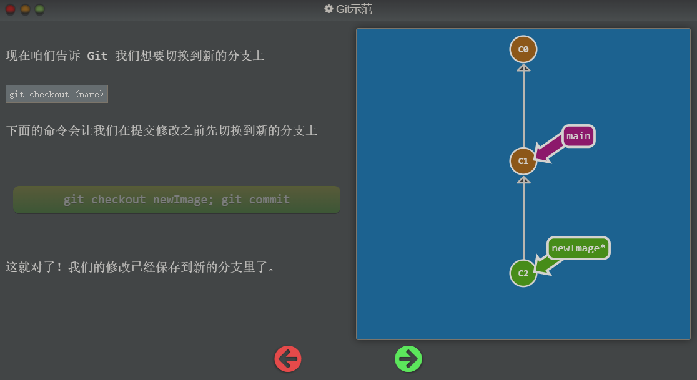
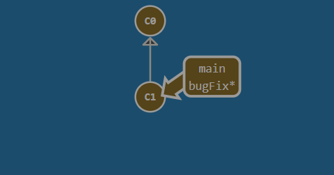

## Git Branch

Git 的分支也非常轻量。它们只是简单地指向某个提交纪录 —— 仅此而已。所以许多 Git 爱好者传颂：

 `早建分支！多用分支！`

这是因为即使创建再多的分支也不会造成储存或内存上的开销，并且按逻辑分解工作到不同的分支要比维护那些特别臃肿的分支简单多了。

在将分支和提交记录结合起来后，我们会看到两者如何协作。现在只要记住使用分支其实就相当于在说：“我想基于这个提交以及它所有的父提交进行新的工作。”

## 图解过程 - 创建分支

执行命令后：

## 图解过程 - 切换分支

执行命令后：因为当前的 HEAD 指向 main 分支，所以 main 分支向前前进了

切换分支：

执行命令后：

## 注意

*注意：在 Git 2.23 版本中，引入了一个名为 `git switch` 的新命令，最终会取代 `git checkout`，因为 `checkout` 作为单个命令有点超载（它承载了很多独立的功能）。 由于现在很多人还无法使用 `switch`，本次课程仍然使用 `checkout` 而不是 `switch`， 但是如果你想尝试一下新命令，我们的应用也是支持的！并且你可以从[这里](https://git-scm.com/docs/git-switch)学到更多关于新命令的内容。*

## 任务

OK，你们都已经准备好使用分支了。当前窗口关闭后， 创建一个名为 `bugFix` 的新分支，然后切换过去。

对了，有个更简洁的方式：如果你想创建一个新的分支同时切换到新创建的分支的话，可以通过 `git checkout -b <your-branch-name>` 来实现。

## 任务实现过程

1. 初始状态

2. 创建 bugFix 分支并切换过去 `git branch bugFix; git switch bugFix` 或 `git branch bugFix; git checkout bugFix`  或 `git checkout -b bugFix` 

## 总结：

创建分支：`git branch branch_name`

切换分支：`git checkout branch_name` 或者 `git switch branch_name`

创建分支并直接切换：`git checkout -b branch_name`