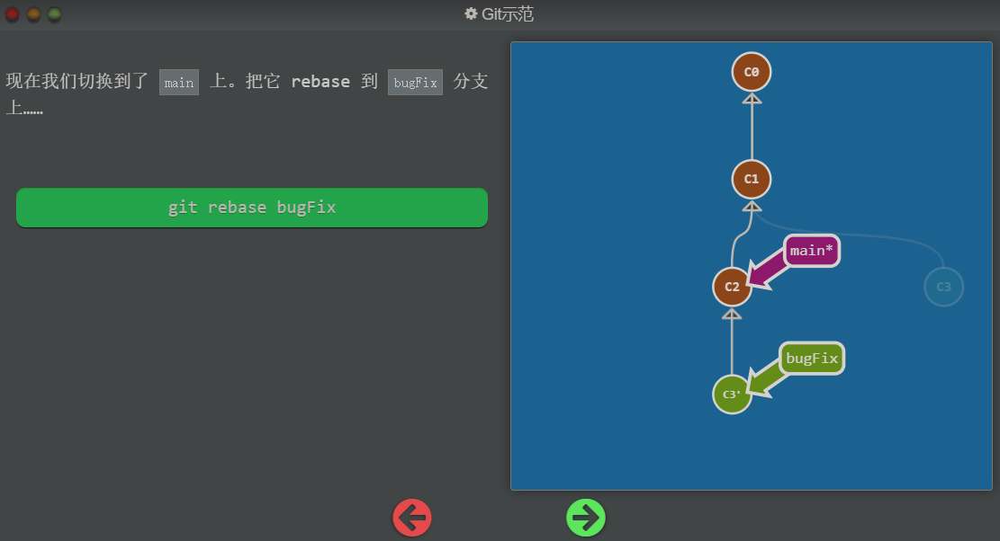

## Git Rebase

第二种合并分支的方法是 `git rebase`。Rebase 实际上就是取出一系列的提交记录，“复制”它们，然后在另外一个地方逐个的放下去。

Rebase 的优势就是可以创造更线性的提交历史，这听上去有些难以理解。如果只允许使用 Rebase 的话，代码库的提交历史将会变得异常清晰。

咱们还是实际操作一下吧……

## 图解过程

执行 `git rebase main` 后的结果：

当执行命令后，会把当前所使用的分支所指向的记录复制一份放在 main 分支所指向的记录的后边，并且在执行命令前所使用的分支在执行命令后也会指向复制品

但这时候，main 分支所指向的记录还没有更新

切换分支到 main 上边

`git rebase bugFix` 其中 rebase 理解为变基操作，就是把当前的正在使用的分支的基变为 bugFix 所指向的记录，但是这并不是简单的把 HEAD 所指向的记录放在 bugFix 下边，而是换了一个分支的开发基底，合并了！

## CSDN 博客理解 reabse 操作

传送门：https://blog.csdn.net/weixin_42310154/article/details/119004977

## 任务

要完成此关，执行以下操作：

- 新建并切换到 `bugFix` 分支
- 提交一次
- 切换回 main 分支再提交一次
- 再次切换到 bugFix 分支，rebase 到 main 上

祝你好运！

## 任务实现过程

1. 初始状态

2. 创建 `bugFix` 分支并切换到此分支上
   `git checkout -b bugFix` 或者 `git branch bugFix; git switch bugFix` 或 `git branch bugFix; git checkout bugFix`

3. 在 bugFix 分支提交一次记录
   `git commit`

4. 切换到 main 分支，并提交一次记录

   `git switch main; git commit`

5. 切换到 bugFix 分支，并且把 bugFix 给 rebase 到 main 上
   `git switch bugFix; git rebase main`
   这样看上去像是线性开发的过程，rebase 的过程就像是合并，但是原理有小的差距

## 总结

修改`当前分支的基底`成为`另外一个分支的最新提交节点`
修改当前分支的基底为 `branch_name` 分支的最新节点： `git rebase branch_name`