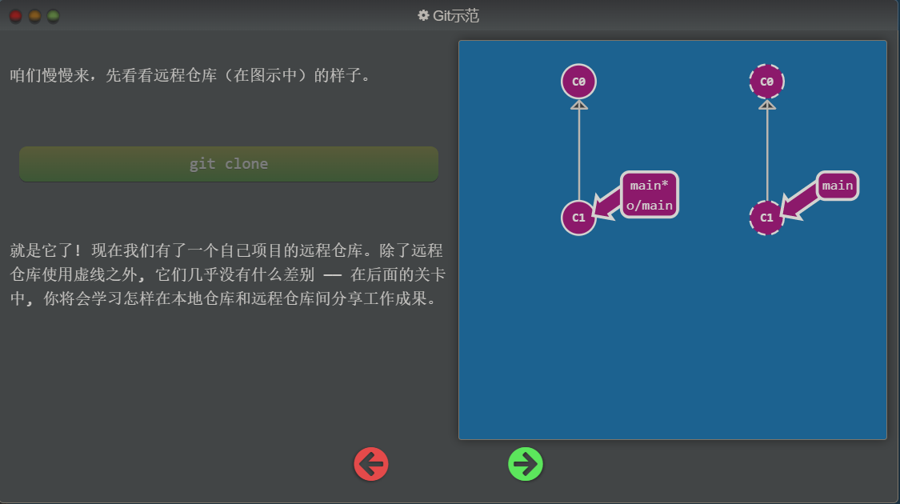
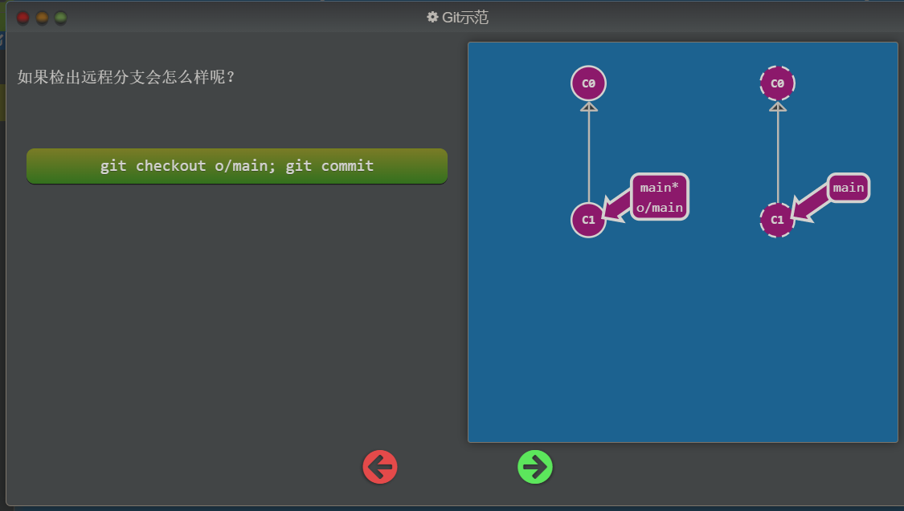
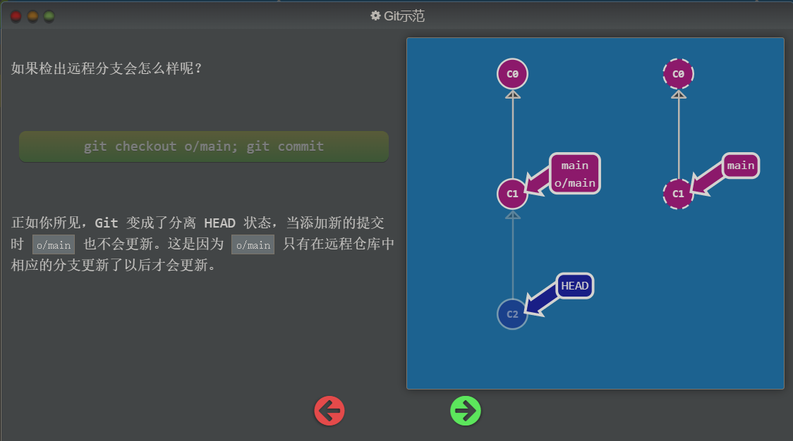
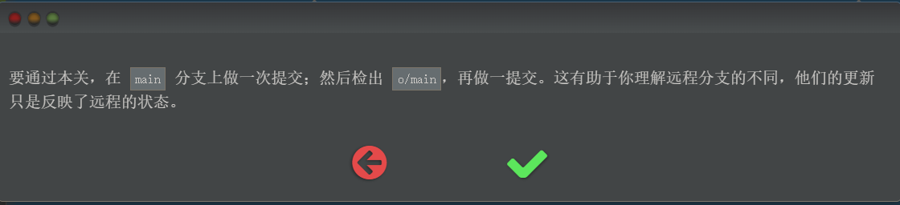

## 远程篇

远程仓库的概念：

远程仓库并不复杂, 在如今的云计算盛行的世界很容易把远程仓库想象成一个富有魔力的东西, 但实际上它们只是你的仓库在另个一台计算机上的拷贝。你可以通过因特网与这台计算机通信 —— 也就是增加或是获取提交记录

话虽如此, 远程仓库却有一系列强大的特性

- 首先也是最重要的的点, 远程仓库是一个强大的备份。本地仓库也有恢复文件到指定版本的能力, 但所有的信息都是保存在本地的。有了远程仓库以后，即使丢失了本地所有数据, 你仍可以通过远程仓库拿回你丢失的数据。
- 还有就是, 远程让代码社交化了! 既然你的项目被托管到别的地方了, 你的朋友可以更容易地为你的项目做贡献(或者拉取最新的变更)

现在用网站来对远程仓库进行可视化操作变得越发流行了(像 [GitHub](https://github.com/)), 但远程仓库**永远**是这些工具的顶梁柱, 因此理解其概念非常的重要!

## 我们创建远程仓库的命令

直到现在, 教程都聚焦于**本地**仓库的操作（branch、merge、rebase 等等）。但我们现在需要学习远程仓库的操作 —— 我们需要一个配置这种环境的命令, 它就是 `git clone`。 从技术上来讲，`git clone` 命令在真实的环境下的作用是在**本地**创建一个远程仓库的拷贝（比如从 github.com）。 但在我们的教程中使用这个命令会有一些不同 —— 它会在远程创建一个你本地仓库的副本。显然这和真实命令的意思刚好相反，但是它帮咱们把本地仓库和远程仓库关联到了一起，在教程中就凑合着用吧。

## 01-Git-Clone 远程仓库

在这个教程中使用 `git clone` 来创建远程仓库：

注意：在创建远程仓库后，可以发现在本地的仓库多了一个分支就是 `o/main` 分支

`git clone` 完成关卡

## 02-远程分支

什么是远程分支，有什么特点：

远程分支：

既然你已经看过 `git clone` 命令了，咱们深入地看一下发生了什么。

你可能注意到的第一个事就是在我们的本地仓库多了一个名为 `o/main` 的分支, 这种类型的分支就叫**远程**分支。由于远程分支的特性导致其拥有一些特殊属性。

远程分支反映了远程仓库(在你上次和它通信时)的**状态**。这会有助于你理解本地的工作与公共工作的差别 —— 这是你与别人分享工作成果前至关重要的一步.

远程分支有一个特别的属性，在你检出时自动进入分离 HEAD 状态。Git 这么做是出于不能直接在这些分支上进行操作的原因, 你必须在别的地方完成你的工作, （更新了远程分支之后）再用远程分享你的工作成果。

我自己的想法：HEAD 指向的节点就是当前所看到的内容，工作原理应该是对当前文件夹中的数据进行了一个自动的替换来完成的。

### 为什么有 `o/`？

你可能想问这些远程分支的前面的 `o/` 是什么意思呢？好吧, 远程分支有一个命名规范 —— 它们的格式是:

- `<remote name>/<branch name>`

因此，如果你看到一个名为 `o/main` 的分支，那么这个分支就叫 `main`，远程仓库的名称就是 `o`。

大多数的开发人员会将它们主要的远程仓库命名为 `origin`，并不是 `o`。这是因为当你用 `git clone` 某个仓库时，Git 已经帮你把远程仓库的名称设置为 `origin` 了

不过 `origin` 对于我们的 UI 来说太长了，因此不得不使用简写 `o` :) 但是要记住, 当你使用真正的 Git 时, 你的远程仓库默认为 `origin`!

说了这么多，让我们看看实例。

在本地分支提交记录：

`git checkout main` 切换到本地分支

`git commit` 在本地分支提交记录

当完成了本地分支提交记录后，本地分支的 main 的指向会跟随 HEAD 一起向前走，也就是 星号 * 还在 main 的右上角，并没有进入 HEAD 分离的状态

在远程分支上提交记录：

`git checkout o/main` 切换到远程仓库的 main 分支上

`git commit` 提交记录到远程仓库上

当完成了远程分支的提交记录后，远程分支的 o/main 的指向并不会改变，也就是 星号 * 不在 o/main 的右上角了，这时候也就自动进入了 HEAD 分离的状态，HEAD 会指向新的记录节点