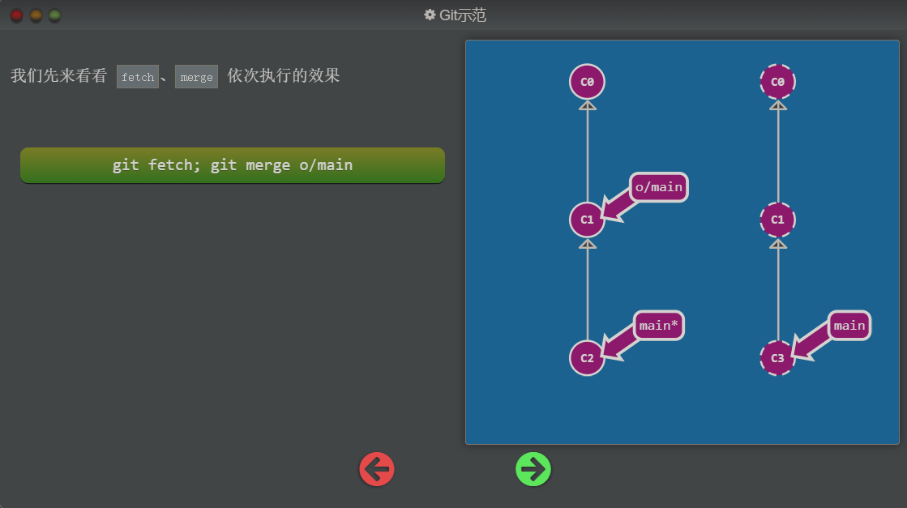
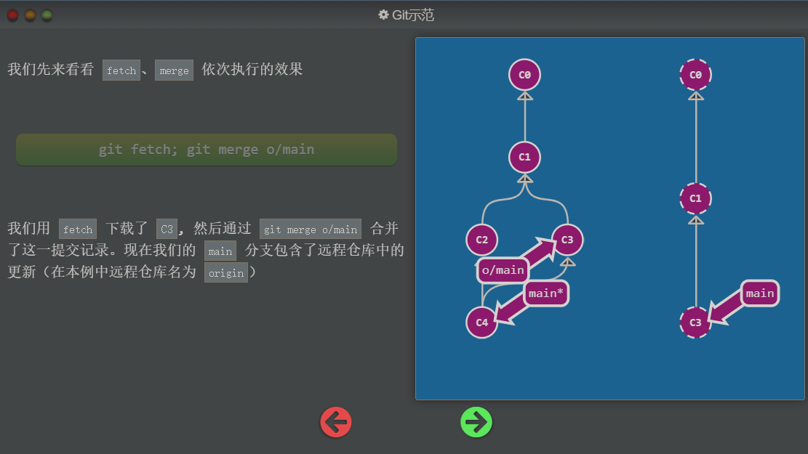
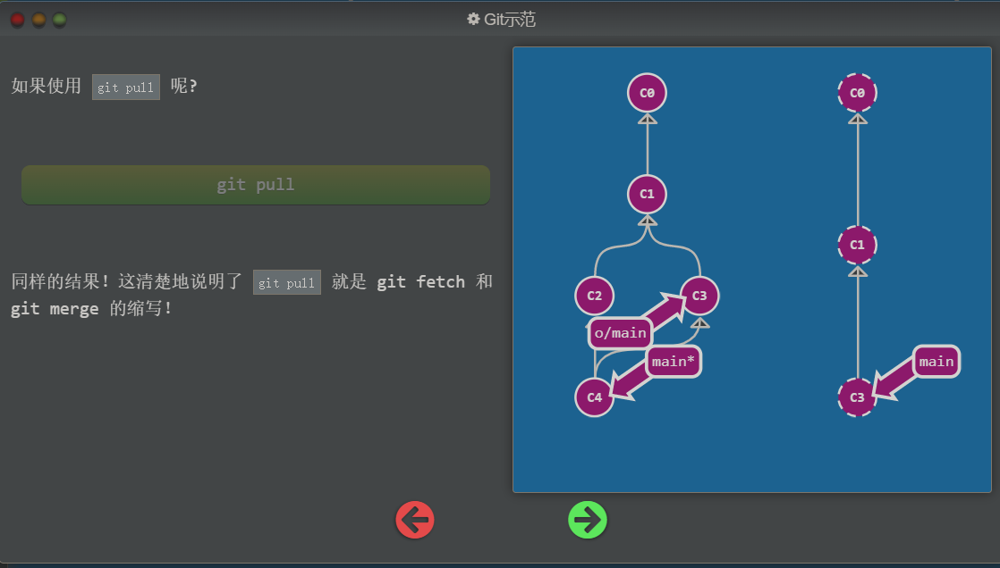

## 什么是 git pull

既然我们已经知道了如何用 `git fetch` 获取远程的数据, 现在我们学习如何将这些变化更新到我们的工作当中。

其实有很多方法的 —— 当远程分支中有新的提交时，你可以像合并本地分支那样来合并远程分支。也就是说就是你可以执行以下命令:

- `git cherry-pick o/main`
- `git rebase o/main`
- `git merge o/main`
- 等等

实际上，由于先抓取更新再合并到本地分支这个流程很常用，因此 Git 提供了一个专门的命令来完成这两个操作。它就是我们要讲的 `git pull`。

也就是说：

`git pull 等价于 git fetch + git merge`

通过下图使用 `git pull` 的方式来拉取代码，从而可以明白，每次执行 `git pull` 的时候，并不会直接由远程仓库的代码覆盖本地的代码，那是因为自动将本地代码 `C2` 和远程仓库代码 `C3` 做了一个合并操作，合并成为了既含有本地更新的代码也含有远程仓库更新的代码的 `C4` 节点

