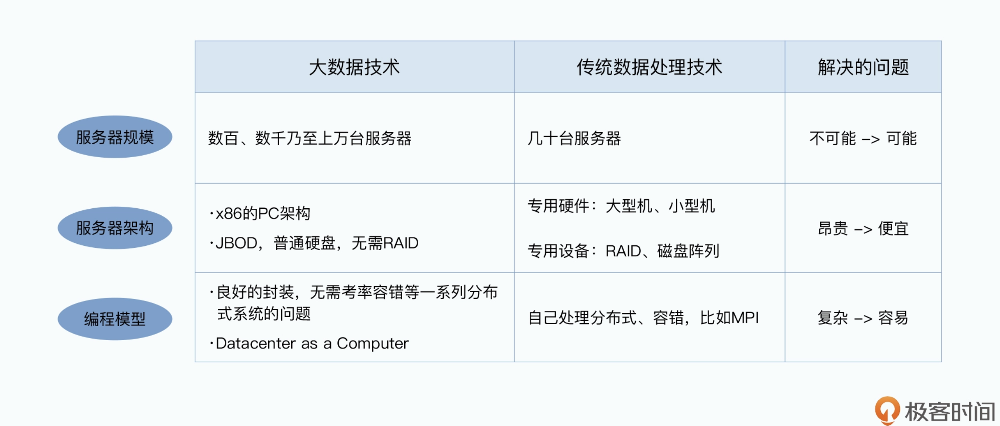
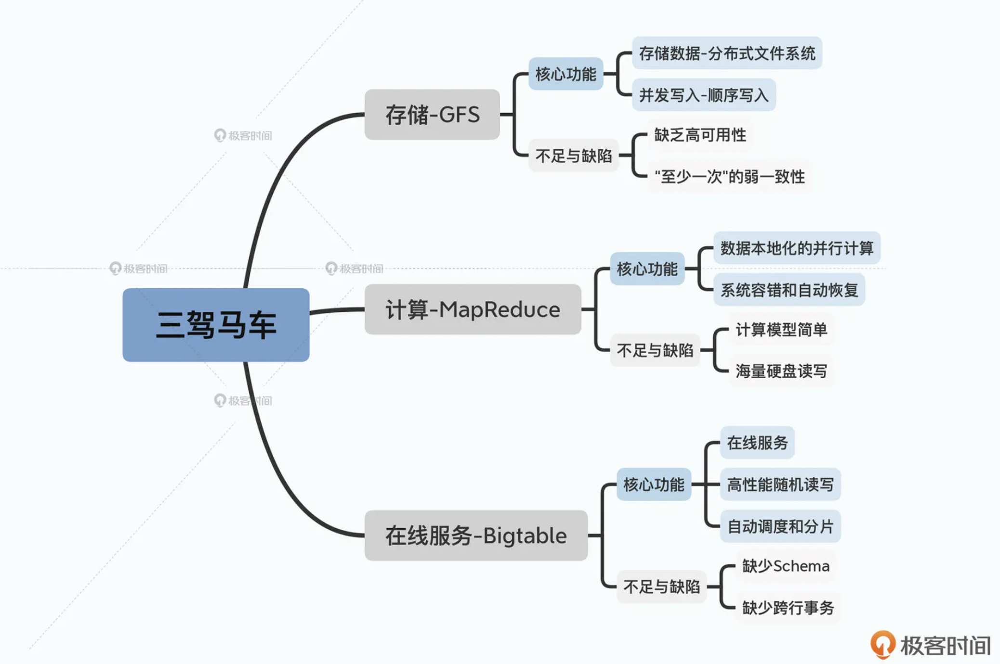
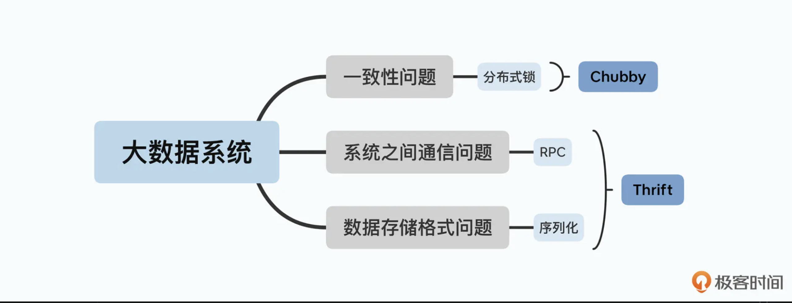
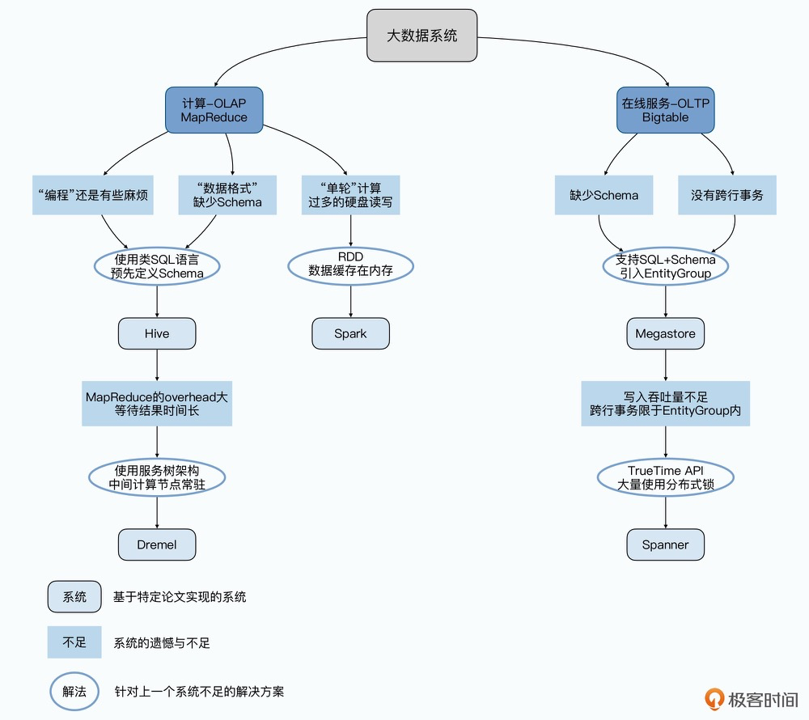
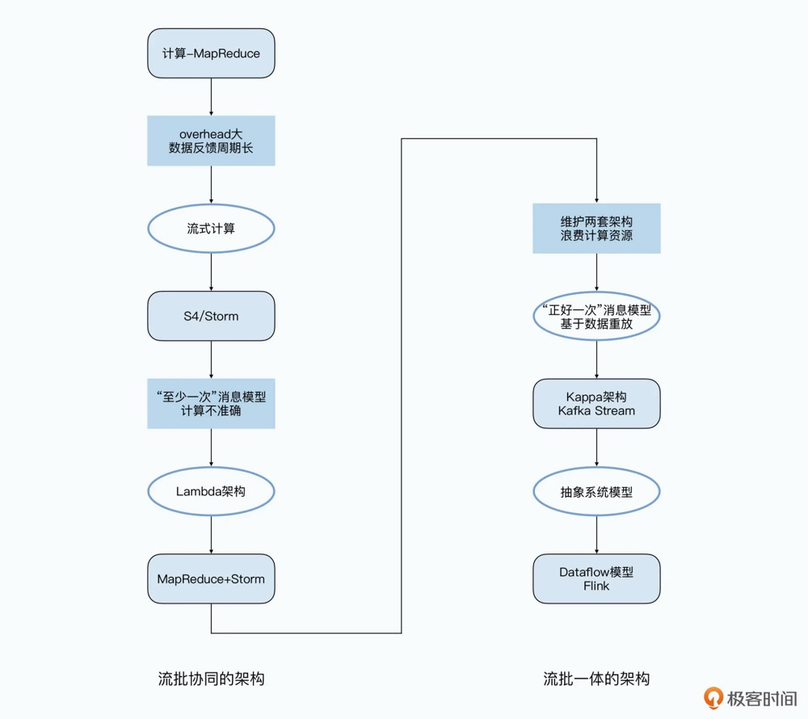
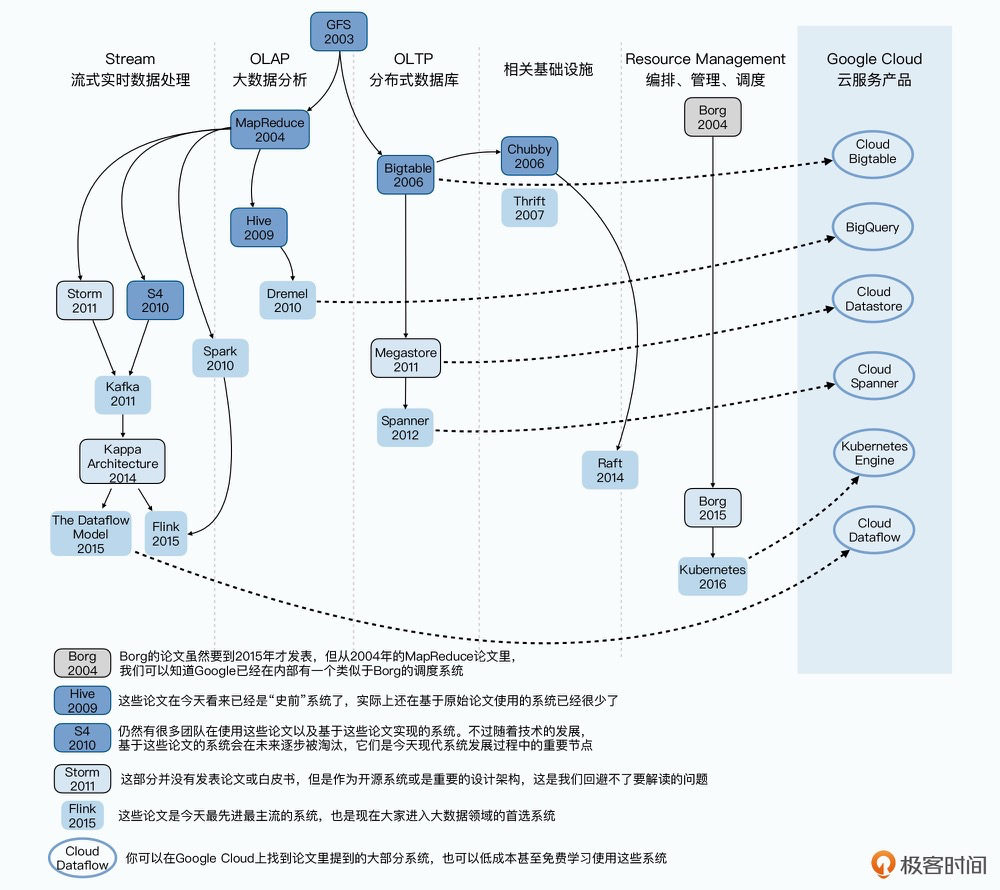

# 大数据框架

所有的“大数据”框架，都希望就算没有“大数据”底层技术知识的工程师，也能很容易地处理海量数据

# 三驾马车和基础设施

Google 就在 2003、2004 以及 2006 年，分别抛出了三篇重磅论文：“大数据”的三驾马车：GFS、MapReduce 和 Bigtable

1. GFS 的论文发表于 2003 年，它主要是解决了数据的存储问题。作为一个上千节点的分布式文件系统，Google 可以把所有需要的数据都能很容易地存储下来。
2. MapReduce 解决分布式计算问题
3. Bigtable 解决随机读取问题（因为 GFS 和 MapReduce 只能在顺序读写上得到良好的性能，但不能很好的处理随机读取的问题，使用 GFS 作为底层存储 并且 使用 MemTable + SSTable 作为底层存储格式）

# 三驾马车依赖的基础

1. 为了保障数据一致性的分布式锁。对于这个问题，Google 在发表 Bigtable 的同一年，就发表了实现了 Paxos 算法的 Chubby 锁服务的论文
2. 数据怎么序列化以及分布式系统之间怎么通信，看 Facebook 在 2007 年发表的 Thrift 的相关论文

GFS 和 MapReduce 的开源实现是 Hadoop 的 HDFS 和 MapReduce

Bigtable 的开源实现是 HBase （使用了 Thrift 作为和外部多语言进行通信的协议）

# 大数据技术的来龙去脉

1. OLAP : On-Line Analysis Processing 在线分析处理
2. OLTP : On-Line Transaction Processing 在线联机处理

# 计算模型的进化

# 大数据论文的关系网

