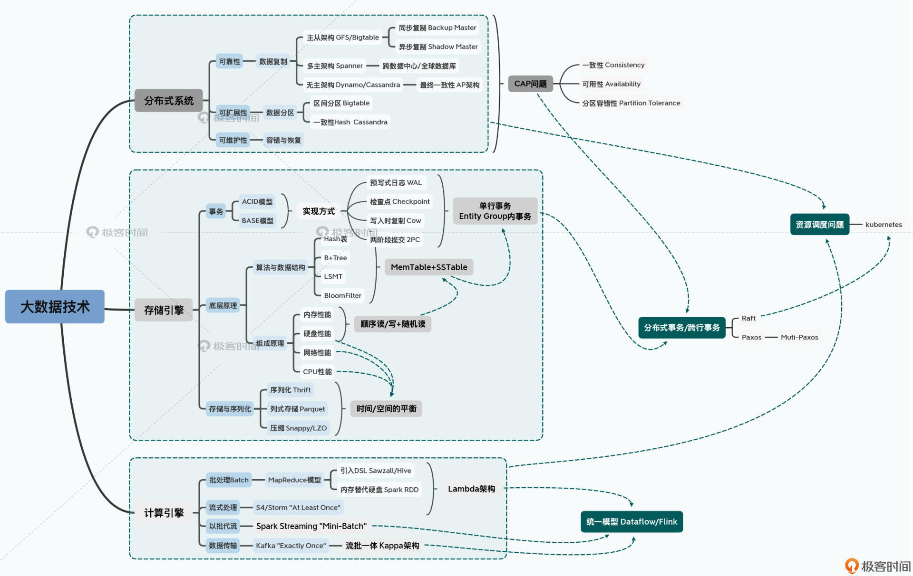
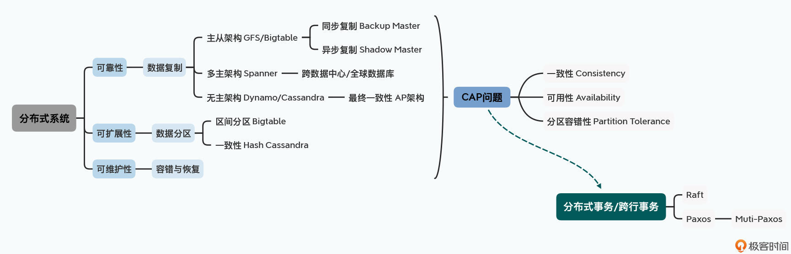
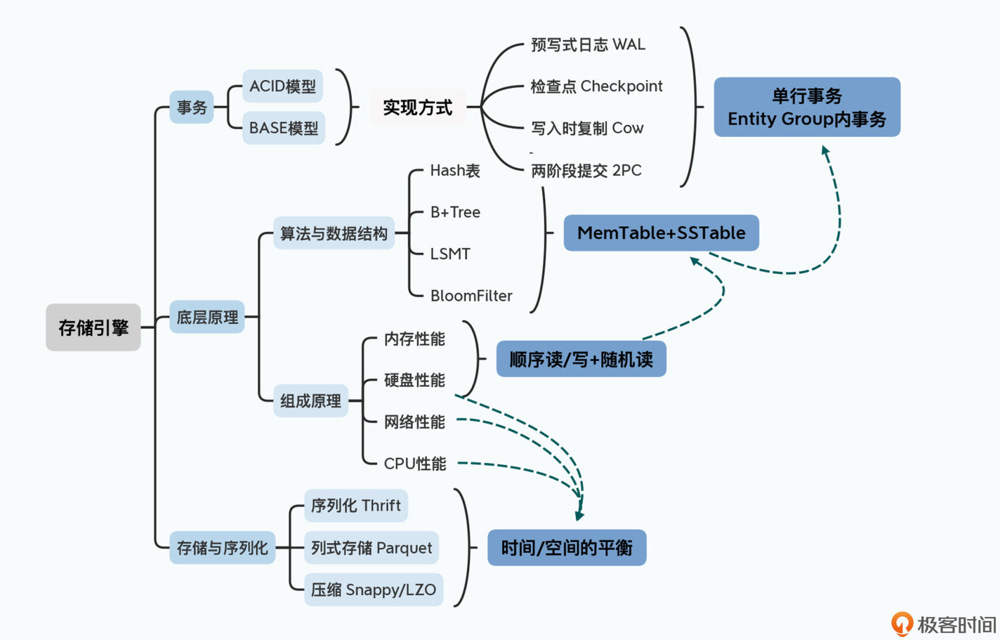
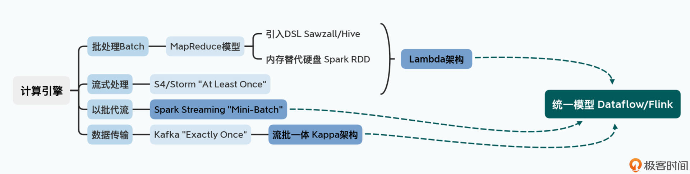

# 大数据领域知识地图

# 三个切入点

1. 分布式系统
2. 单节点的存储引擎
3. 计算引擎

## 1 分布式系统

1. 可靠性：主从架构（同步复制 适合 Backup Master、异步复制 适合 Shadow Master）、多主架构、无主架构
2. 可扩展性：通过区间进行分片（Bigtable）、通过哈希进行分区（一致性Hash，典型代表 Cassandra）
3. 可维护性：考虑容错性、避免网络终端出现错误判断 使用 容错算法、抛出 CAP 这个所谓的 "不可能三角"

分布式系统的核心是 CAP

CAP 分别代表：（就是在 CAP 三者之间做权衡）

1. 一致性
2. 可用性
3. 分区容错性

因此，选择 主从架构、复制策略、分片策略、容错和恢复方案 都是根据应用场景的权衡

## 2 单节点存储引擎

1. 事务
2. 底层的数据如何写入和存储
3. 数据的序列化问题

## 3 计算引擎

# 学习方法

1. 首先，是从第一性原理出发，尝试自己去设计系统和解决问题
2. 其次，是多做交叉阅读和扩展阅读
3. 最后，是给自己制定一个明确的学习目标，然后围绕学习目标，进行泛读和精读、理论和实践的结合

# 学习资料

1. 首先是 Storm 的作者南森·马茨（Nathan Marz）的“Big Data”，现在也有中译本叫做《大数据系统构建》。对于人为错误的容错问题的思考，为我们带来了著名的 Lambda 架构。在我看来，即使到今天 Lambda 架构也并不过时。
2. 其次是俗称 DDIA 的这本《数据密集型应用系统设计》，这本书梳理了整个大数据领域的核心技术脉络，是一本非常合适的架构入门书。
3. 第三本是专注于流式处理的《Streaming System》，不过目前还没有中译本上市。
4. 如果你更喜欢通过视频课程学习，那么去看一看来自 MIT 的课程 6.824 的 Distributed System 绝对错不了。我在这里放上了Youtube和B 站的视频链接。
5. 最后是一份很容易被人忽视的资料，就是 2009 年 Jeff Dean 在 Cornell 大学的一个讲座“Designs， Lessons and Advice from Building Large Distributed Systems”的 PPT，我也推荐你去看一看，对于理解大数据系统的真实应用场景很有帮助。

