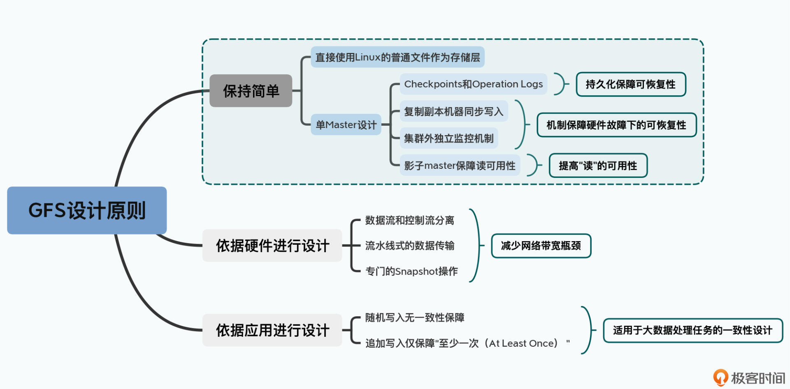
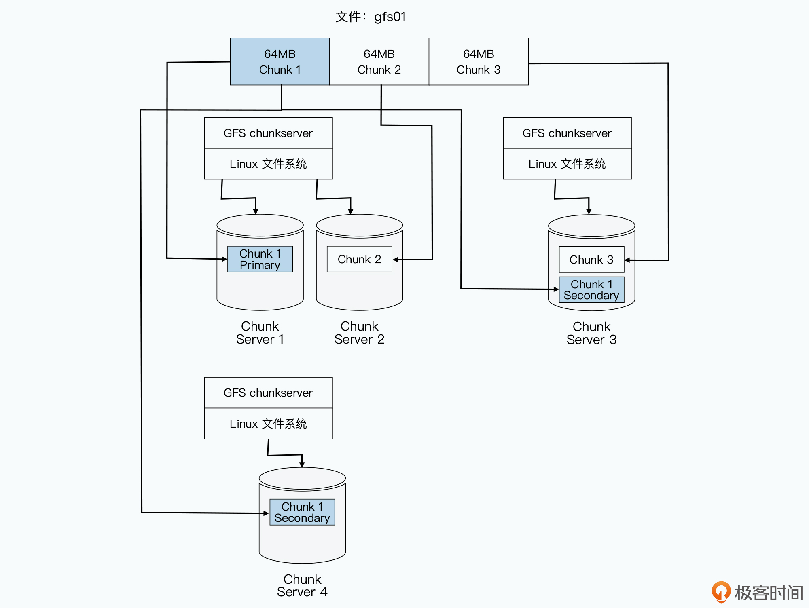
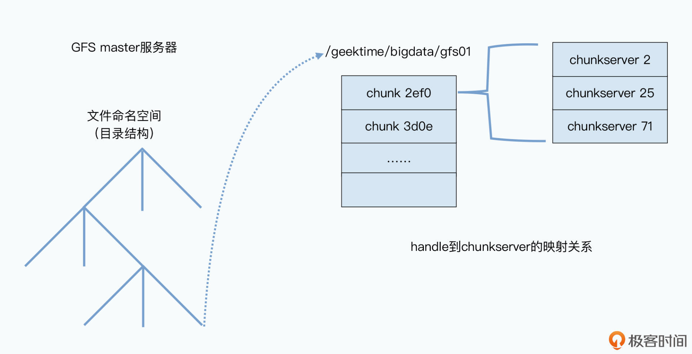
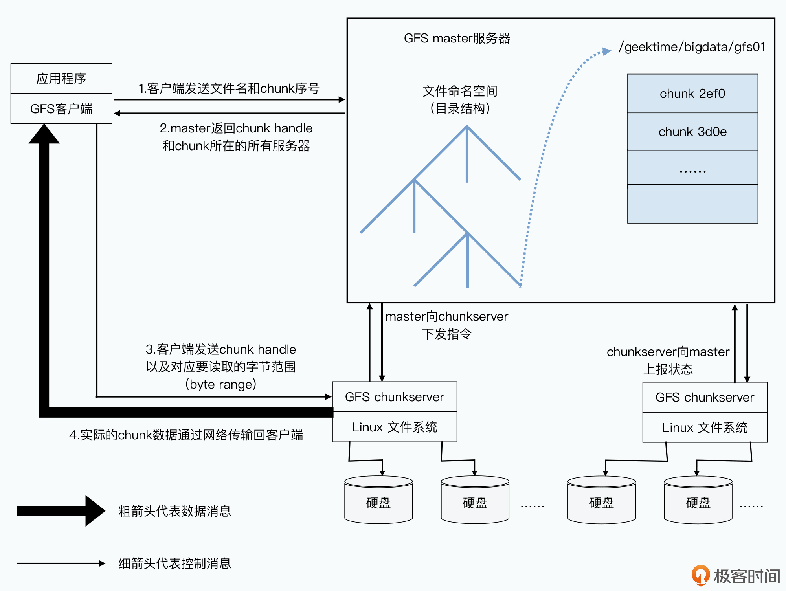
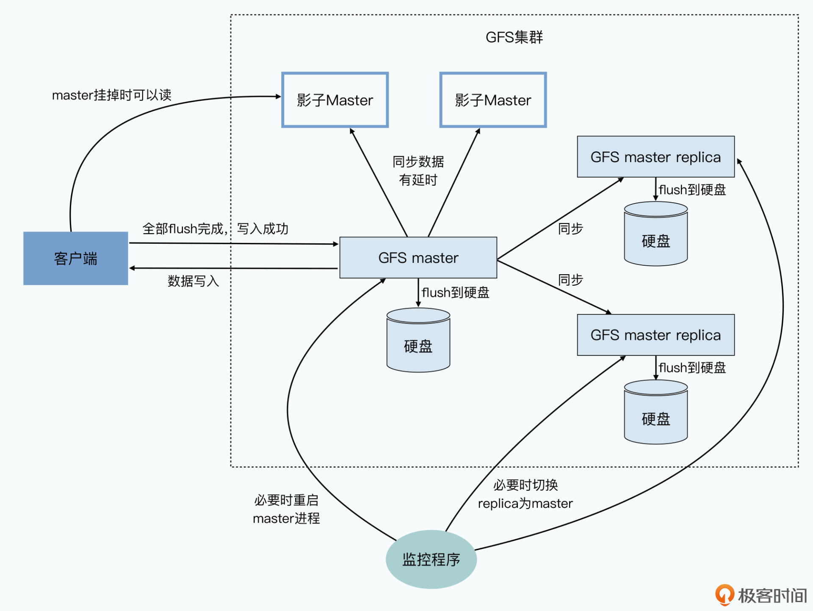

# 三个原则

1. 第一个是以工程上“简单”作为设计原则：单 Master 设计原则。采用 Checkpoints、操作日志（Operation Logs）、影子 Master（Shadow Master）等一系列的工程手段 尽可能保证 可恢复（Recoverable） 和 可用性（Availability）
2. 第二个是根据硬件特性来进行设计取舍：重视顺序读写性能，不保证随机读写，尽量避免网络传输（因为当时的网卡带宽很小）
3. 第三个是根据实际应用的特性，放宽了数据一致性（consistency）的选择

检查点（checkpoints）

checkpoints 相当于是一个快照，可以让系统恢复到 checkpoints 的快照

https://blog.csdn.net/qq_35423154/article/details/113931951

# Master 的三个身份

1. 相对于存储数据的 Chunkserver，Master 是一个目录服务（目录服务，Chunkserver 的主节点）
2. 相对于用于恢复 Master 数据的 Backup Master，它是同步复制的主从架构下的主节点（Backup Master的主节点）
3. 相对于为了保障读取数据的可用性而设立的 Shadow Master，它是异步复制的主从架构下的主节点（Shadow Master 的主节点）

## 1 目录服务

GFS 中

1. 数据以 64M 为单位进行切分
2. 每一个块叫 chunk
3. 每个 chunk 有唯一的编号 handle
4. 每个 chunk 默认复制三份副本（replica），一份主数据（primary），两分副本数据（secondary），防止数据丢失，分摊并发读取的系统压力

三种元信息 （Meta）

1. 命名空间信息
2. 文件被拆分成了哪些 chunk （全路径名 到 chunk handle 的映射关系）
3. 这些 chunk 存储在哪些 chunkserver 上（chunk handle 到 chunkserver 的映射关系）

左边到中间的 chunk_id 是 命名信息到 chunk_id 的映射关系，一个命名信息对应着多个 chunk_id（因为一个文件被切分成多个 chunk）

中间到右边的是 handle 到 chunkserver 的映射，每一个 handle 默认对应着 3 哥副本，因此每个 chunk_id 对应 3 台 主机（可以是主机名 或 直接就是 ip 地址）

读取文件的过程：

1. 客户端 ==> master : （1） 文件名 （2）读取哪一段数据。可以根据文件的 offset 和 length 来计算出要读取的内容在哪个 chunk 从而通过 master 记录的映射关系找到 chunk 所在的主机 host。客户端可以自行计算 chunk 是第几块，但是不能自行计算这个块号对应的 handle，这个 handle 还是需要去查 master 的映射表
2. master ==> 客户端：要读取的数据副本的 handle 以及所在的 chunkserver（客户端自行选择去哪个 chunkserver 读取数据）
3. 客户端：直接去任意一个 chunkserver 读取所需要的数据

## 2 Backup Master && Shadow Master 的主节点

master 的快速恢复性 和 可用性保障

1. 使用 checkpoints 和 operation logs 进行回复
2. 硬件故障时，使用 Backup Master 进行替换（Backup Master 是 Master 的备胎），采用同步复制，只有全部的 Backup Master 都完成相同的操作后才视为一次操作完成

对于 Shadow Master 而言是采用异步复制的策略

不过，为了让集群中的其他 chunkserver 以及客户端不用感知这个变化，GFS 通过一个规范名称（Canonical Name）来指定 master，而不是通过 IP 地址或者 Mac 地址。这样，一旦要切换 master，这个监控程序只需要修改 DNS 的别名，就能达到目的。有了这个机制，GFS 的 master 就从之前的可恢复（Recoverable），进化成了能够快速恢复（Fast Recovery）

## 使用 Shadow Master

读取到过时信息的情况：

1. 第一个，是 master 挂掉了；
2. 第二个，是挂掉的 master 或者 Backup Master 上的 Checkpoints 和操作日志，还没有被影子 Master 同步完；
3. 第三个，则是我们要读取的内容，恰恰是在没有同步完的那部分操作上；

# 总结

恢复措施：

这些措施，包括 Checkpoints 和操作日志、Backup Master、外部的监控程序，以及只读的影子 Master

当你日后在做系统设计的时候，就从“简单”开始，让系统更容易维护和迭代

