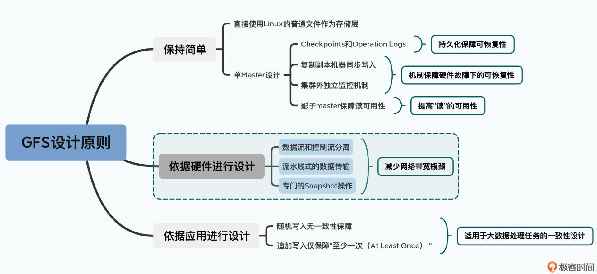
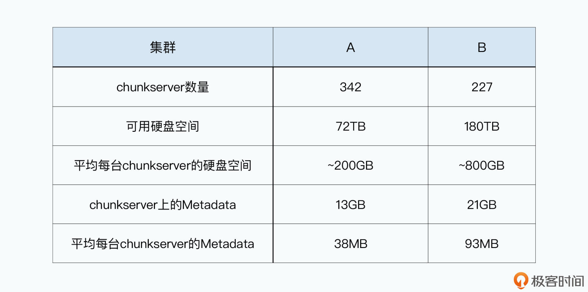
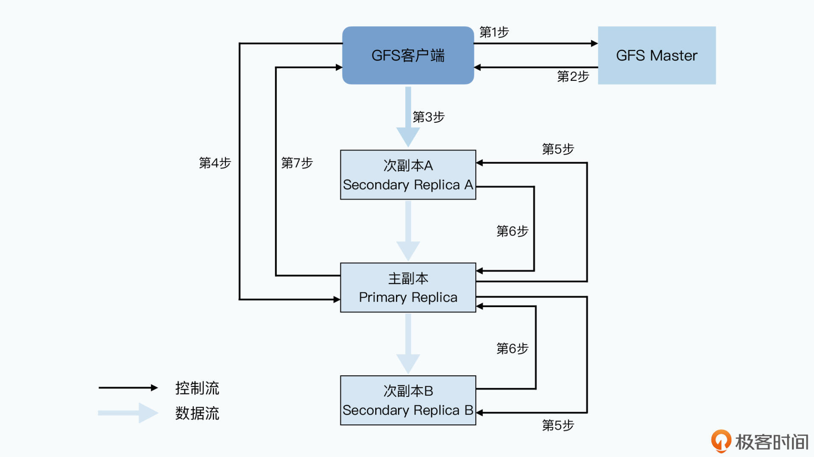

# 设计原则

# GFS 硬件配置

测试环境配置：

1. 19 台服务器：1 台 master、2 台 master 的只读副本、16 台 chunkserver
2. 16 台 GFS 的客户端
3. 所有服务器的硬件配置完全相同，都是双核 1.45 GHz 的奔腾 3 处理器 + 2GB 内存 + 两块 80GB 的 5400rpm 的机械硬盘 + 100 Mbps 的全双工网卡
4. 然后把所有的 19 台 GFS 集群的机器放在一台交换机上，所有的 16 台 GFS 的客户端放在另外一台交换机上，两台交换机之间通过带宽是 1Gbps 的网线连接起来

真实环境配置：（推测出来的）

主要瓶颈在于网卡的吞吐量上

# 数据写入

# 分离数据流和控制流

采用流水线式的网络传输，而不是客户端并发发送三份数据副本同时到3台 chunkserver 上，每台 chunkserver 服务器接收数据的同时对外发送数据（输入和输出的带宽是独立的）

几百台的服务器通常需要经过 3 层交换机，因此选择距离 GFS 客户端最近的服务器发送数据，随后采用流水线传输数据

1. 同一个机架（Rack）上的服务器，都会接入到一台接入层交换机（Access Switch）上；
2. 各个机架上的接入层交换机，都会连接到某一台汇聚层交换机（Aggregation Switch）上；
3. 而汇聚层交换机，再会连接到多台核心交换机（Core Switch）上;

# 最大利用带宽，同时减少网络瓶颈

GFS 最大利用网络带宽，同时又减少网络瓶颈的选择就是：

1. 首先，客户端把数据传输给离自己“最近”的，也就是在同一个机架上的次副本 A 服务器；
2. 然后，次副本 A 服务器再把数据传输给离自己“最近”的，在不同机架，但是处于同一个汇聚层交换机下的主副本服务器上；
3. 最后，主副本服务器，再把数据传输给在另一个汇聚层交换机下的次副本 B 服务器；

# 独特的 Snapshot 操作（文件复制）

对于 GFS 的文件复制操作，就直接在每个 chunk 所在的 chunkserver 把该机器上的 chunk 复制一下到本地再去 master 登记一下就行了，这样就避免了网络传输

如果本地的存储空间不足以支持这样的操作的话，那就只能网络传输咯

