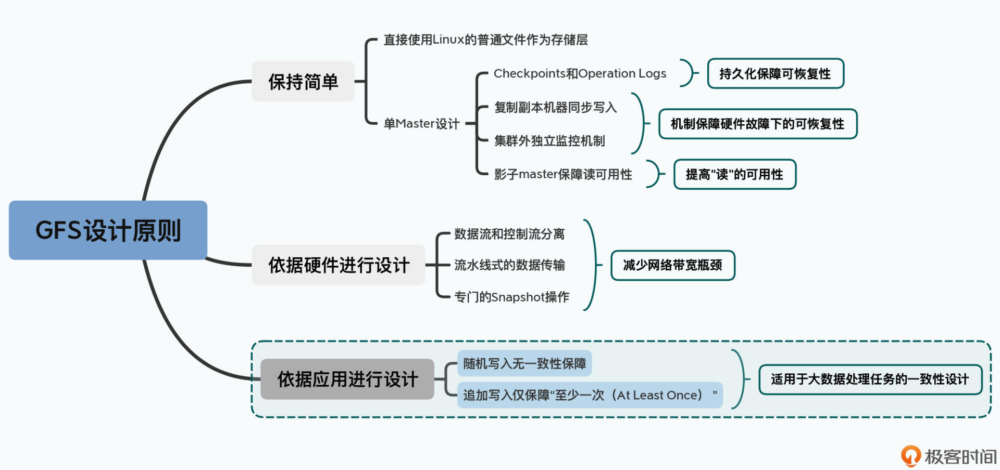
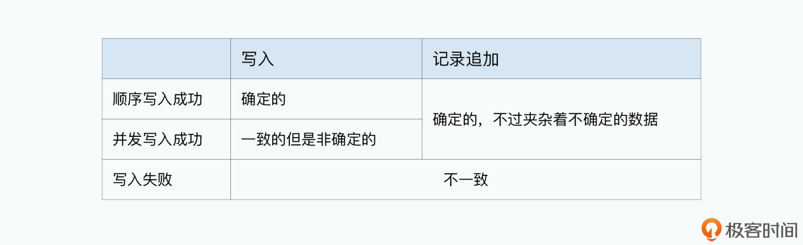
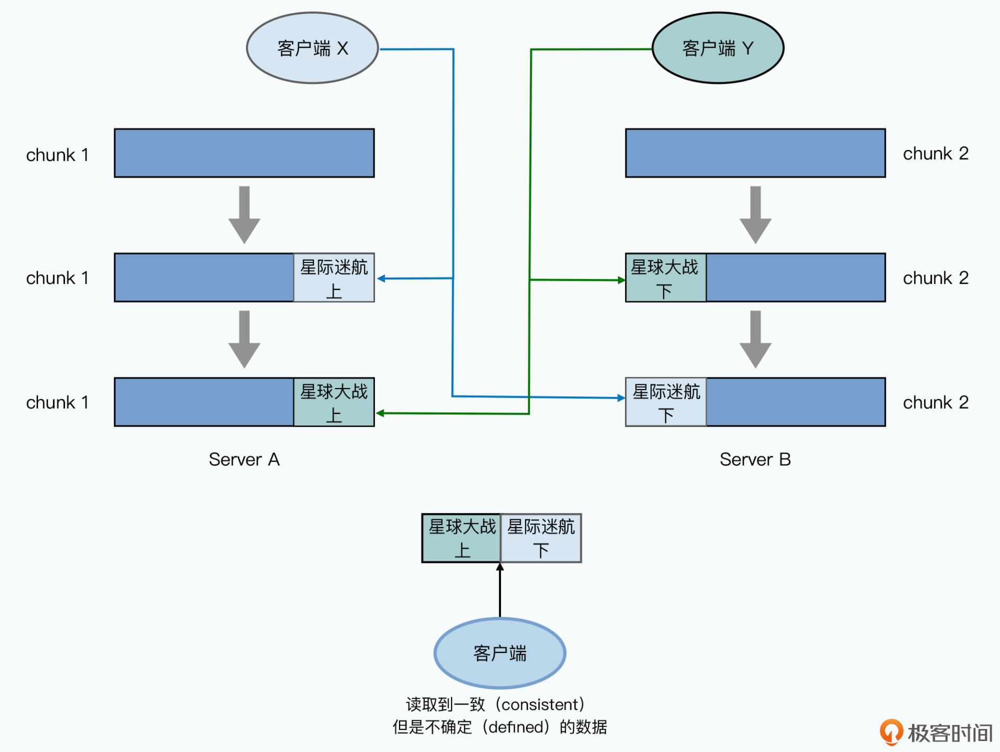
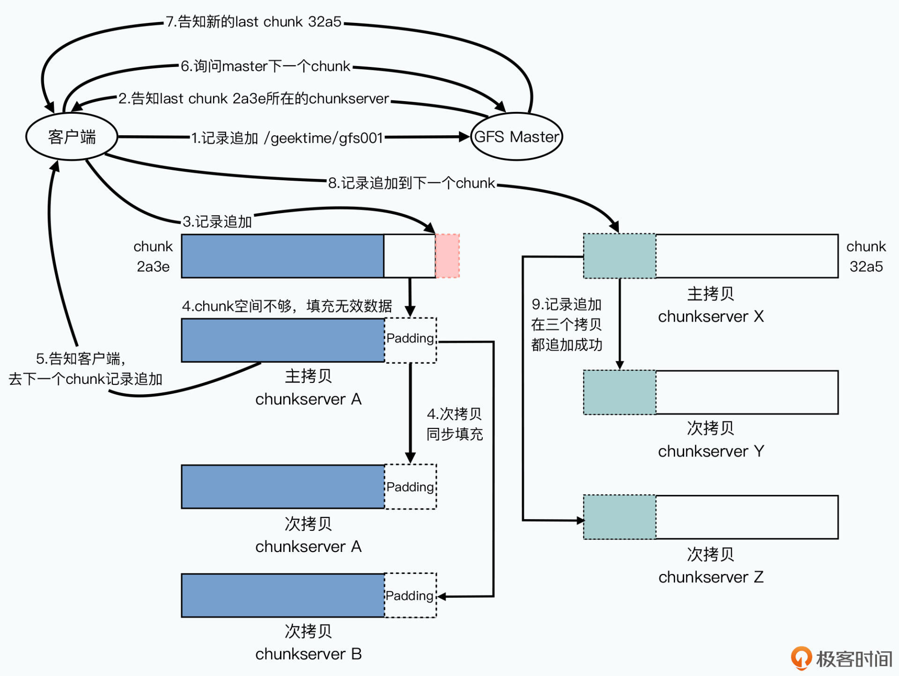
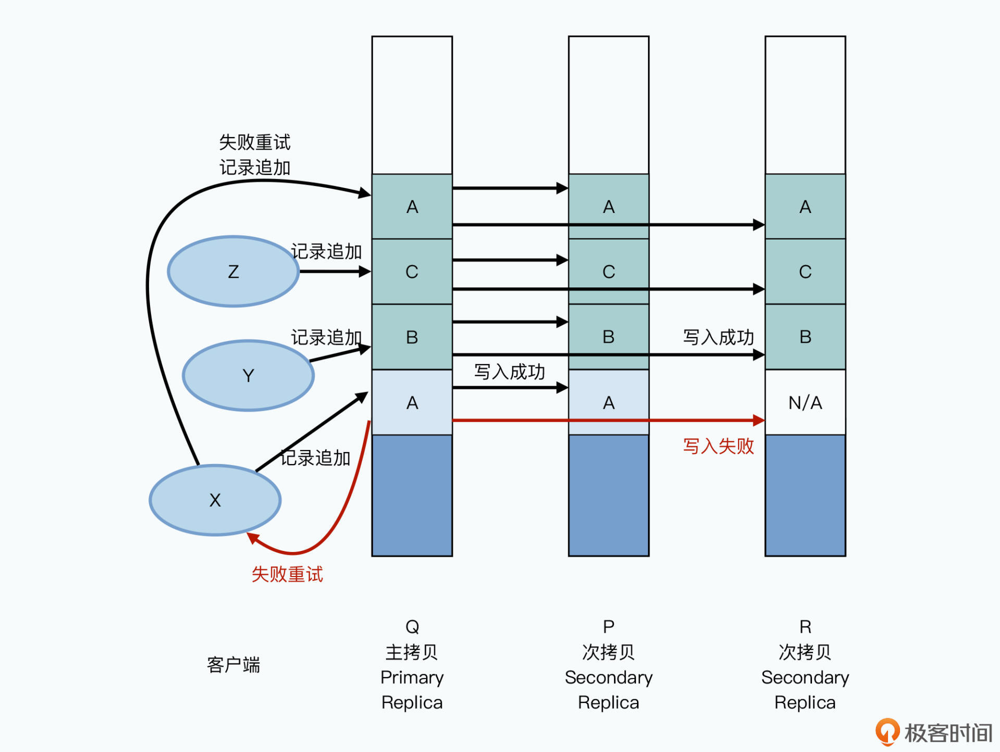
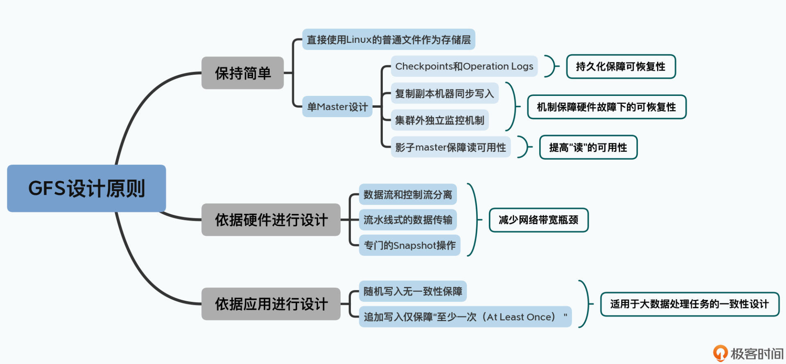

# 一致性问题

CAP 理论：

1. 一致性（Consistency）
2. 可用性（Availability）
3. 分区容错性（Partition tolerance）

# 一致性的两个要求

1. 第一个，就叫做“一致的（Consistent）”。这个就是指，多个客户端无论是从主副本读取数据，还是从次副本读取数据，读到的数据都是一样的。
2. 第二个，叫做“确定的（Defined）”。这个要求会高一些，指的是对于客户端写入到 GFS 的数据，能够完整地被读到。

# 一致性不满足的例子

客户端 X 和 Y 同时对同一个文件进行写入，因为一个大文件要被拆分成很多个 chunk 进行存储，并且写入的过程是先把要写入的文件缓存在内存中，然后 主副本 chunkserver 对两个次副本 chunkserver 发送写入命令，这才将内存中的数据持久化到磁盘中。图中的副本全部都在同一台服务器中。假设，客户端 X 和 客户端 Y 要写入的内容都已经在内存中缓存完成，这时候，对于 X 数据的写入命令先达了ServerA，随后是 Y 数据的写入命令到达 chunkserver A，但是对于次副本服务器 B 则写入命令的到达顺序刚好相反，这时候对于不同段的 chunk 写入顺序不一致，导致文件是错误的，不完整的，不确定的。

# 至少写入一次的保障

追加记录的时候是相对靠谱的

1. 成功写入的情况

2. 第一次写入的时候再其中一台 chunkserver 写入 A 数据的副本失败

1. 在 Q 和 P 上，chunkserver 里面的数据顺序是 A-B-C-A；
2. 但是在 R 上，chunkserver 里面的数据顺序是 N/A-B-C-A；
3. 也就是 Q 和 P 上，A 的数据被写入了两次，而在 R 上，数据里面有一段是有不可用的脏数据。

至少一次写入模型带来的好处：

1. 高并发和高性能
2. 简单

GFS 设计原则总结：

