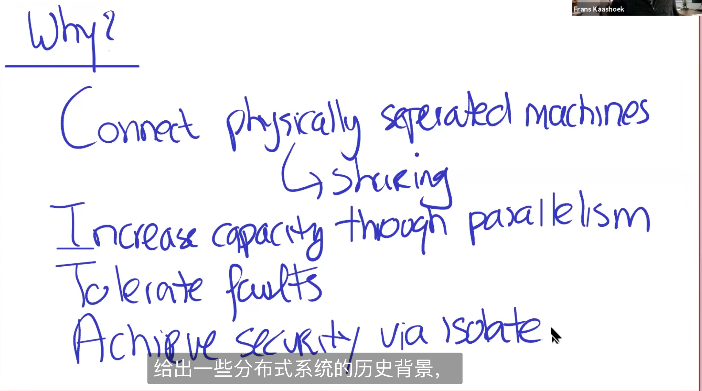

研究案例：mapreduce paper

## 1 什么是分布式系统？distributed system

1. 互联网连接 数据中心（data center） 、客户端（client）、服务器（servers）
2. 数据中心内部可能是分布式的（如图右侧所示）
3. 数据中心和数据中心之间可能是通过专用的物理线路进行连接而不是通过互联网（如图右侧和右下角的方块所示）
4. multiple networked cooperating computers 多网络协调工作的计算机

## 2 why ?

1.  连接物理上分散的机器，从而允许数据共享（connect physically seperated machines）
2.  通过并行提高性能（increse capacity through parallesim）
3. 容忍错误（tolerate faults）
4. 在需要获得安全性时候，分布系统在物理上的隔离性可提供（achieve security）

## 3 分布式系统的历史背景

最近几十年来发生了什么？

historical context

1. 出现的原因：local area networks 由于局域网的原因出现的、域名系统DNS、邮件系统；这些都是早期分布式系统的主要例子（主要集中在 1980 年）
2. 现在的分布式系统：Datacenters 大型互联网公司的数据中心（1990年初的时候）；big websites 大型网站；web seach 需要爬取大量的数据支持搜索引擎；shopping；
3. 云计算的出现加速了这一发展：应用程序开始在云上进行运算，这导致数据中心进一步增长；如机器学习；和运行自己的网站；因此云计算平台开始允许进行性能的横向扩展；从而实现高并行；高性能
4. 现在的状态：现在成为了一个非常活跃的研究领域 activate；发展也是困难的

现在可以通过论文看那些过去面临需要处理大规模数据的人是如何解决问题的，随着云计算的出现，这一速度进一步加快

在过去，这些系统是大型互联网公司内部的系统，而如今变成了基础设施，对外开放了

## 4 分布式系统面临的挑战 challenges

1. many concurrent part 有很多并发的部分
2. must deal with partial failure 必须处理出现的局部性错误
3. 1 和 2 加起来使得分布式系统变得非常复杂，尤其是第 2 部分
4. tricky realize the performance benefit 很难真正实现性能上的提升

## 5 为什么选择 6.824

why take 6.824

1. interesting：hard problems but powerful solutions （很有趣，虽然问题很困难，但是解决方案很强大）

2. used in real world （在现实世界中被使用）
3. active area of research（在研究领域中很活跃）
4. handsom（很酷 很实用的 编程技巧）

## 6 课程结构 course structure

1. lectures: big ideas （如本节课这样的讲座，讨论一些大的想法）
2. papers: case study（论文通常就是实验案例）
3. labs 1) mapreduce ; 2) replication using raft（构建一个复制任务，其中一台机器宕机后，仍然可以继续工作）；3）replicated key-value service（构建一个键值对复制服务）; 4) sharded key-value service 构建分片的键值服务（实验三中并不能使得它并行获得更高的性能，而实验4的目标就是使用实验3中的多个实例，是的分布式系统在性能上有所提升）所有的测试案例都是公开的 test cases are public 这些测试用例都是非常 tricky 的
4. optional project：可选项目，这个项目是和课程中所看到的那些论文类似的系统

## 7 focus

1. Storage 存储基础架构：key-value 服务器；FS 文件系统
2. Computation 计算架构：编排或构建分布式应用程序 MapReduce
3. Comunication 通信架构：6.829是一门网络系统相关的课程；RPC；通信和分布式系统的关联
4. Abstraction 抽象：寻找类似于单个计算机的抽象

## 8 main topics

1. fault tolerance 容错性：1）available 可用性，关键技术是 replication 复制  2) recoverability 可恢复性 关键技术是 logging 日志，durable storage 持久性存储
2. consistency 一致性：有了并发后，事情就变得复杂了起来
3. performance 性能：1) 吞吐量 throughout 2) tail latency 尾部延迟（一台机器的慢，导致整体变慢）
4. implementation：管理并发性；

## 9 mapreduce

lab1 实现 mapreduce

对非专业认识写分布式程序变得容易

approach 方法：1）map & reduce 函数都是顺序代码 2）mr 框架处理所有的分布式相关的事情

**Abstract view**

f1  f2  f3 三个文件

词频统计：

1. map 每个文件生成 键值对：单词&数量 
2. shuffle 把所有键相同的内容放在一起；经过 shuffle 后，reduce 函数就可以独立的运行；shuffle 操作是昂贵的
3. reduce 聚合 key value pairs

Q：比如对数组进行排序
A：使用桶排序的方法

**implementation**

Q：中间生成的文件是否会被传送到 reducer 所在的机器上？
A：是的，在这里传输文件是通过网络传输的，所以网络通信发生在这里

Q：coordinator 是否会对文件进行 split 操作
A：不会，这些文件都存储在 GFS 上，是通过 user 来指定需要对哪些文件进行计算的

Q：排序是如何进行的？谁对它进行排序？
A：排序发生在 shuffle 操作，将 key 想通的 key-value pairs 收集在一起发送给 reduce 函数

**fault tolerance**

coordinator 如果发现哪一个 map 或 reduce 函数失败了，那么就重启这个任务，失败是指一定时间内没有响应

map 函数可以运行两次，有可能碰到网络分区的情况 map 任务还在继续运行，只是不能喝 coordinator 进行通信了而已

reduce 函数也是可以这样的

coordinator 可以失败吗？不可以，如果 coordinator 失败的话，整个作业必须重新运行

slow worker 机器太慢的情况下？当计算快要完成的时候，coordinator 会把剩下的任务重新分配给其他的机器进行计算，最终会取那个最先完成的结果，处理尾部延迟的方法就是复制任务。

  

